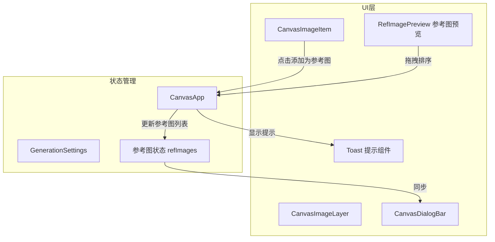

# 设计文档

## 概述

本功能包含两个部分：
1. 为画布图片添加"添加为参考图"按钮，允许用户将生成的图片直接添加到参考图列表中
2. 支持拖拽调整参考图的顺序，以便用户在提示词中使用"图1"、"图2"等描述时能够灵活调整对应关系

## 架构



## 组件和接口

### 1. CanvasImageItem 组件修改

在现有的操作按钮组中添加"添加为参考图"按钮：

```typescript
interface CanvasImageItemProps {
  // ... 现有属性
  onAddAsReference?: () => void;  // 新增：添加为参考图回调
}
```

### 2. CanvasImageLayer 组件修改

传递添加为参考图回调到子组件：

```typescript
interface CanvasImageLayerProps {
  // ... 现有属性
  onAddAsReferenceImage?: (image: CanvasImage) => void;  // 新增：添加为参考图回调
}
```

### 3. CanvasApp 添加参考图函数

```typescript
/**
 * 处理添加为参考图 - 将图片添加到参考图列表
 * @param image 要添加的图片
 */
const handleAddAsReferenceImage = async (image: CanvasImage) => void;
```

### 4. CanvasDialogBar 参考图拖拽排序

在参考图预览区域添加拖拽排序功能：

```typescript
interface CanvasDialogBarProps {
  // ... 现有属性
  refImages: UploadedImage[];
  onRefImagesChange: (images: UploadedImage[]) => void;  // 用于更新排序后的列表
}
```

拖拽排序使用 HTML5 原生拖拽 API 实现：
- `draggable="true"` 使元素可拖拽
- `onDragStart` 记录拖拽开始的索引
- `onDragOver` 处理拖拽经过时的视觉反馈
- `onDrop` 处理放置并更新列表顺序

## 数据模型

### 图片转换为参考图

从 `CanvasImage` 转换为 `UploadedImage` 格式：

```typescript
// 画布图片格式
interface CanvasImage {
  id: string;
  url: string;
  thumbnailUrl?: string;
  // ... 其他字段
}

// 需要转换为参考图格式
interface UploadedImage {
  id: string;
  file: File;        // 使用空文件占位
  base64?: string;   // 不需要
  preview: string;   // 使用图片 URL
  name: string;      // 生成名称
  size: number;      // 设为 0
}
```

### 参考图最大数量

参考图列表有最大数量限制（通常为 4 张），需要在添加前检查。

## 正确性属性

*属性是系统在所有有效执行中应保持为真的特征或行为——本质上是关于系统应该做什么的形式化陈述。属性作为人类可读规范和机器可验证正确性保证之间的桥梁。*

### Property 1: 按钮可见性状态

*对于任意* 画布图片，当图片处于生成中状态（isPlaceholder 为 true 且 url 为空）或失败状态（isFailed 为 true）时，"添加为参考图"按钮不应渲染；当图片处于正常状态（有有效 url 且未失败）时，按钮应该渲染。

**Validates: Requirements 1.2, 1.3**

### Property 2: 添加参考图格式正确性

*对于任意* 包含有效 URL 的画布图片，调用添加为参考图函数后，参考图列表中应包含一个新的 UploadedImage 对象，其 preview 字段等于图片的 URL。

**Validates: Requirements 2.1**

### Property 3: 重复图片检测

*对于任意* 已存在于参考图列表中的图片 URL，再次调用添加为参考图函数应返回重复标识，且参考图列表长度不变。

**Validates: Requirements 3.3**

### Property 4: 拖拽排序保持元素

*对于任意* 参考图列表和有效的拖拽操作（从索引 A 移动到索引 B），排序后的列表应包含与原列表相同的所有元素，仅顺序不同。

**Validates: Requirements 4.2**

### Property 5: 拖拽排序位置正确性

*对于任意* 参考图列表和有效的拖拽操作（从索引 A 移动到索引 B），被拖拽的元素应出现在目标位置 B。

**Validates: Requirements 4.2**

## 错误处理

### 参考图列表已满

当参考图数量达到最大限制时：
1. 阻止添加操作
2. 显示提示信息："参考图数量已达上限"

### 重复添加

当同一图片已存在于参考图列表中时：
1. 阻止添加操作
2. 显示提示信息："该图片已添加为参考图"

### 无效图片

当图片 URL 无效或为空时：
1. 阻止添加操作
2. 显示提示信息："无法添加该图片"

## 测试策略

### 单元测试

1. 测试按钮在不同图片状态下的渲染逻辑
2. 测试图片转换为 UploadedImage 格式的正确性
3. 测试重复检测逻辑
4. 测试拖拽排序函数的正确性

### 属性测试

使用 fast-check 库进行属性测试：

1. **Property 1 测试**：生成随机图片状态，验证按钮可见性逻辑
2. **Property 2 测试**：生成随机图片 URL，验证添加后参考图列表的正确性
3. **Property 3 测试**：生成随机参考图列表和图片，验证重复检测逻辑
4. **Property 4 测试**：生成随机参考图列表和拖拽操作，验证元素保持不变
5. **Property 5 测试**：生成随机参考图列表和拖拽操作，验证目标位置正确

### 测试标注格式

每个属性测试必须使用以下格式标注：
```typescript
// **Feature: add-as-reference-image, Property {number}: {property_text}**
```

### 测试配置

- 属性测试最少运行 100 次迭代
- 使用 fast-check 作为属性测试库
