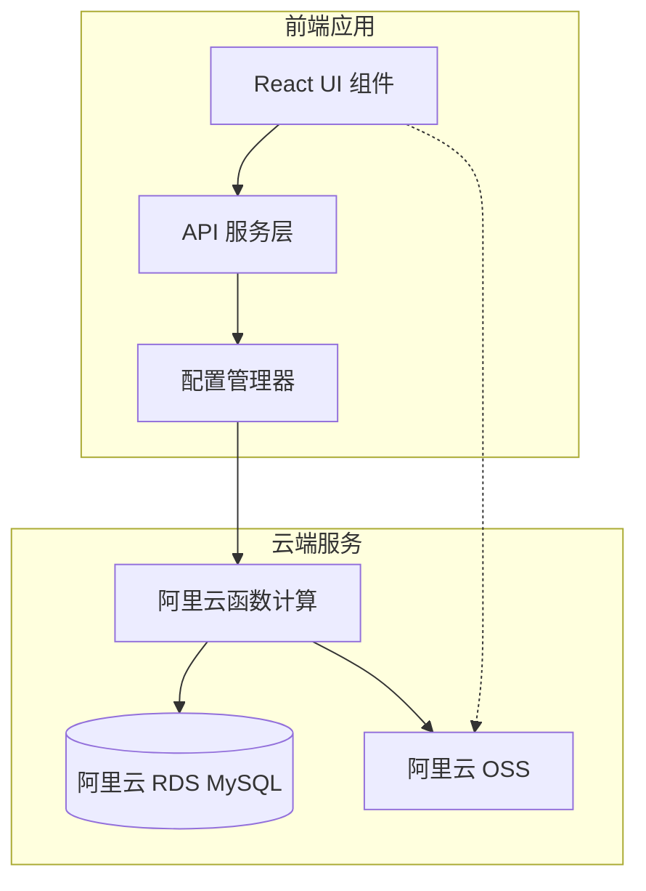

# 阿里云数据库集成设计文档

## 概述

本设计文档描述了将 Nano Banana AI 绘画应用完全迁移到云端存储架构的技术方案。系统将移除所有本地存储依赖，所有数据（图片信息、API 配置、OSS 配置）都直接存储在阿里云 MySQL 数据库和对象存储中，为后续前后端分离架构奠定基础。

## 架构设计

### 整体架构



### 核心设计原则

1. **云端优先**: 所有数据直接存储在云端，不使用浏览器本地存储
2. **安全第一**: 敏感信息使用 AES-256 加密存储
3. **RESTful 接口**: 为前后端分离做准备的 API 设计
4. **错误容错**: 网络中断时优雅降级，恢复后自动重连
5. **性能优化**: 分页加载和索引优化

## 组件和接口

### 数据库服务层 (DatabaseService)

```typescript
interface DatabaseService {
  // 连接管理
  connect(config: DatabaseConfig): Promise<boolean>
  disconnect(): Promise<void>
  testConnection(): Promise<boolean>
  getConnectionStatus(): ConnectionStatus
  
  // 图片数据操作
  saveImage(image: SavedImage): Promise<SavedImage>
  getImages(pagination: PaginationOptions): Promise<PaginatedResult<SavedImage>>
  updateImage(id: string, updates: Partial<SavedImage>): Promise<SavedImage>
  deleteImage(id: string): Promise<void>
  
  // 配置管理
  saveApiConfig(config: ApiConfig): Promise<void>
  getApiConfig(): Promise<ApiConfig | null>
  saveOSSConfig(config: OSSConfig): Promise<void>
  getOSSConfig(): Promise<OSSConfig | null>
  
  // 表结构管理
  initializeTables(): Promise<void>
  migrateSchema(version: string): Promise<void>
}
```

### 加密服务 (EncryptionService)

```typescript
interface EncryptionService {
  encrypt(data: string, key?: string): string
  decrypt(encryptedData: string, key?: string): string
  generateKey(): string
  hashPassword(password: string): string
  verifyPassword(password: string, hash: string): boolean
}
```

### 云函数接口 (CloudFunctionAPI)

```typescript
interface CloudFunctionAPI {
  // 数据库操作
  callFunction<T>(functionName: string, params: any): Promise<CloudFunctionResult<T>>
  
  // 具体函数调用
  testConnection(config: DatabaseConfig): Promise<boolean>
  initTables(config: DatabaseConfig): Promise<void>
  saveImage(config: DatabaseConfig, image: SavedImage): Promise<SavedImage>
  getImages(config: DatabaseConfig, pagination: PaginationOptions): Promise<SavedImage[]>
  updateImage(config: DatabaseConfig, id: string, updates: Partial<SavedImage>): Promise<void>
  deleteImage(config: DatabaseConfig, id: string): Promise<void>
  saveConfig(config: DatabaseConfig, type: 'api' | 'oss', data: any): Promise<void>
  getConfig(config: DatabaseConfig, type: 'api' | 'oss'): Promise<any>
}
```

## 数据模型

### 数据库表结构

#### images 表
```sql
CREATE TABLE images (
  id VARCHAR(50) PRIMARY KEY,
  url TEXT NOT NULL,
  original_url TEXT,
  prompt TEXT NOT NULL,
  model VARCHAR(100) NOT NULL,
  aspect_ratio VARCHAR(20) DEFAULT 'auto',
  image_size VARCHAR(10) DEFAULT '1K',
  ref_images JSON,
  created_at TIMESTAMP DEFAULT CURRENT_TIMESTAMP,
  updated_at TIMESTAMP DEFAULT CURRENT_TIMESTAMP ON UPDATE CURRENT_TIMESTAMP,
  tags JSON,
  favorite BOOLEAN DEFAULT FALSE,
  oss_key TEXT,
  oss_uploaded BOOLEAN DEFAULT FALSE,
  user_id VARCHAR(50) DEFAULT 'default',
  
  INDEX idx_created_at (created_at),
  INDEX idx_model (model),
  INDEX idx_favorite (favorite),
  INDEX idx_user_id (user_id)
);
```

#### user_configs 表
```sql
CREATE TABLE user_configs (
  user_id VARCHAR(50) PRIMARY KEY,
  api_config JSON,
  oss_config JSON,
  preferences JSON,
  created_at TIMESTAMP DEFAULT CURRENT_TIMESTAMP,
  updated_at TIMESTAMP DEFAULT CURRENT_TIMESTAMP ON UPDATE CURRENT_TIMESTAMP
);
```

#### operation_logs 表
```sql
CREATE TABLE operation_logs (
  id BIGINT AUTO_INCREMENT PRIMARY KEY,
  operation VARCHAR(50) NOT NULL,
  table_name VARCHAR(50) NOT NULL,
  record_id VARCHAR(50),
  user_id VARCHAR(50) DEFAULT 'default',
  status ENUM('SUCCESS', 'FAILED') DEFAULT 'SUCCESS',
  error_message TEXT,
  created_at TIMESTAMP DEFAULT CURRENT_TIMESTAMP,
  
  INDEX idx_created_at (created_at),
  INDEX idx_operation (operation),
  INDEX idx_user_id (user_id)
);
```

### TypeScript 数据模型

```typescript
interface DatabaseConfig {
  host: string
  port: number
  database: string
  username: string
  password: string
  ssl: boolean
  enabled: boolean
}

interface ConnectionStatus {
  isConnected: boolean
  lastConnected: Date | null
  error: string | null
}

interface PaginationOptions {
  page: number
  pageSize: number
  sortBy?: string
  sortOrder?: 'ASC' | 'DESC'
  filters?: Record<string, any>
}

interface PaginatedResult<T> {
  data: T[]
  total: number
  page: number
  pageSize: number
  totalPages: number
}

interface CloudFunctionResult<T = any> {
  success: boolean
  data?: T
  error?: string
  message?: string
}
```

## 正确性属性

*属性是一个特征或行为，应该在系统的所有有效执行中保持为真——本质上是关于系统应该做什么的正式声明。属性作为人类可读规范和机器可验证正确性保证之间的桥梁。*

### 属性反思

在编写正确性属性之前，让我分析预工作中识别的可测试属性，消除冗余：

**数据持久化属性**：
- 属性 1.1（图片保存）、2.1（API配置保存）、3.1（OSS配置保存）都是关于数据保存的，可以合并为一个通用的数据持久化属性
- 属性 1.2（图片加载）、2.2（API配置加载）、3.2（OSS配置加载）都是关于数据加载的，可以合并

**数据更新属性**：
- 属性 1.3（图片更新）、2.3（API配置更新）、3.3（OSS配置更新）可以合并为通用的数据更新属性

**加密存储属性**：
- 属性 2.4（API配置加密）、3.4（OSS配置加密）、4.2（AES-256加密）可以合并为一个加密存储属性

**删除操作属性**：
- 属性 1.4（图片删除）、2.5（API配置删除）可以合并

经过反思，我将创建更简洁且覆盖全面的属性集合：

### 属性 1: 数据持久化一致性
*对于任何*有效的数据对象（图片、API配置、OSS配置），保存到数据库后再查询应该返回相同的数据
**验证需求: 1.1, 2.1, 3.1**

### 属性 2: 数据加载完整性  
*对于任何*存储在数据库中的数据集合，加载操作应该返回所有存储的记录且数据完整
**验证需求: 1.2, 2.2, 3.2**

### 属性 3: 数据更新原子性
*对于任何*数据更新操作，要么完全成功并反映在数据库中，要么完全失败且数据库状态不变
**验证需求: 1.3, 2.3, 3.3**

### 属性 4: 敏感信息加密存储
*对于任何*包含敏感信息的配置数据，存储在数据库中的版本必须是加密的，不能是明文
**验证需求: 2.4, 3.4, 4.2**

### 属性 5: 数据删除完整性
*对于任何*删除操作，目标数据必须从数据库和相关存储（如OSS）中完全移除
**验证需求: 1.4, 2.5**

### 属性 6: 连接安全性验证
*对于任何*数据库连接，必须使用SSL加密且连接参数经过有效性验证
**验证需求: 4.1, 4.5**

### 属性 7: 冲突解决一致性
*对于任何*数据冲突场景，系统必须使用最新时间戳的数据作为最终结果
**验证需求: 5.3**

### 属性 8: 分页加载正确性
*对于任何*大数据集的分页查询，返回的数据总数应该等于所有分页数据的总和
**验证需求: 5.4**

### 属性 9: 连接状态同步
*对于任何*数据库连接状态变化，界面显示的状态必须与实际连接状态一致
**验证需求: 6.1**

### 属性 10: 统计信息准确性
*对于任何*数据加载完成后的统计信息，显示的数量必须与实际加载的数据数量一致
**验证需求: 6.3**

### 属性 11: 操作历史完整性
*对于任何*数据操作，都必须在操作历史中留下对应的记录
**验证需求: 6.5**

### 属性 12: 表结构初始化幂等性
*对于任何*数据库初始化操作，多次执行应该产生相同的表结构结果
**验证需求: 7.1**

### 属性 13: 数据库迁移安全性
*对于任何*表结构更新操作，现有数据必须保持完整且可访问
**验证需求: 7.2**

### 属性 14: 索引创建完整性
*对于任何*新创建的数据表，必须包含设计文档中指定的所有索引
**验证需求: 7.3**

## 错误处理

### 网络错误处理

```typescript
class NetworkErrorHandler {
  private retryCount = 0
  private maxRetries = 3
  private retryDelay = 1000
  
  async executeWithRetry<T>(operation: () => Promise<T>): Promise<T> {
    try {
      const result = await operation()
      this.retryCount = 0 // 重置重试计数
      return result
    } catch (error) {
      if (this.shouldRetry(error) && this.retryCount < this.maxRetries) {
        this.retryCount++
        await this.delay(this.retryDelay * this.retryCount)
        return this.executeWithRetry(operation)
      }
      throw error
    }
  }
  
  private shouldRetry(error: any): boolean {
    return error.code === 'NETWORK_ERROR' || 
           error.code === 'TIMEOUT' ||
           error.code === 'CONNECTION_LOST'
  }
}
```

### 数据库错误处理

```typescript
class DatabaseErrorHandler {
  handleError(error: any): DatabaseError {
    switch (error.code) {
      case 'ER_ACCESS_DENIED_ERROR':
        return new DatabaseError('数据库访问被拒绝，请检查用户名和密码', 'AUTH_ERROR')
      case 'ER_BAD_DB_ERROR':
        return new DatabaseError('数据库不存在，请检查数据库名称', 'DB_NOT_FOUND')
      case 'ECONNREFUSED':
        return new DatabaseError('无法连接到数据库服务器，请检查主机地址和端口', 'CONNECTION_REFUSED')
      case 'ETIMEDOUT':
        return new DatabaseError('数据库连接超时，请检查网络连接', 'TIMEOUT')
      default:
        return new DatabaseError(`数据库操作失败: ${error.message}`, 'UNKNOWN_ERROR')
    }
  }
}
```

## 测试策略

### 单元测试

单元测试将验证具体的功能实现和边缘情况：

- **数据库连接测试**: 验证各种连接参数和错误场景
- **加密解密测试**: 验证 AES-256 加密算法的正确性
- **数据序列化测试**: 验证 JSON 数据的序列化和反序列化
- **错误处理测试**: 验证各种错误场景的处理逻辑
- **分页逻辑测试**: 验证分页计算和边界条件

### 基于属性的测试

基于属性的测试将使用 **fast-check** 库验证通用属性在所有输入下都成立：

- 每个属性测试将运行最少 **100 次迭代**
- 每个属性测试必须使用注释明确标识对应的设计文档属性
- 测试标签格式：`**Feature: aliyun-database-integration, Property {number}: {property_text}**`
- 使用智能生成器约束输入空间，生成有效的测试数据
- 属性测试专注于验证核心逻辑的正确性，不使用模拟数据

### 集成测试

集成测试将验证组件间的协作：

- **端到端数据流测试**: 从前端操作到数据库存储的完整流程
- **云函数集成测试**: 验证与阿里云函数计算的集成
- **多用户并发测试**: 验证多用户同时操作的数据一致性
- **网络中断恢复测试**: 验证网络中断和恢复场景

### 测试数据管理

```typescript
class TestDataManager {
  // 生成测试用的图片数据
  generateRandomImage(): SavedImage {
    return {
      id: `test_${Date.now()}_${Math.random().toString(36).substring(2)}`,
      url: `https://example.com/image_${Math.random()}.jpg`,
      prompt: `测试提示词 ${Math.random()}`,
      model: 'nano-banana-fast',
      aspectRatio: 'auto',
      imageSize: '1K',
      createdAt: new Date(),
      favorite: Math.random() > 0.5,
      ossUploaded: false
    }
  }
  
  // 生成测试用的配置数据
  generateRandomApiConfig(): ApiConfig {
    return {
      apiKey: `test_key_${Math.random().toString(36)}`,
      baseUrl: 'https://test.api.com',
      timeout: 30000,
      retryCount: 3,
      provider: 'Test Provider'
    }
  }
  
  // 清理测试数据
  async cleanupTestData(testIds: string[]): Promise<void> {
    // 清理测试过程中创建的数据
  }
}
```

## 性能优化

### 数据库优化

1. **索引策略**: 为常用查询字段创建复合索引
2. **分页查询**: 使用 LIMIT 和 OFFSET 进行分页
3. **连接池**: 使用连接池管理数据库连接
4. **查询优化**: 避免 N+1 查询问题

### 前端优化

1. **懒加载**: 图片列表使用虚拟滚动
2. **缓存策略**: 合理使用内存缓存减少重复请求
3. **批量操作**: 支持批量上传和删除操作
4. **压缩传输**: 使用 gzip 压缩 API 响应

## 安全考虑

### 数据加密

```typescript
class AESEncryption {
  private algorithm = 'aes-256-gcm'
  private keyLength = 32
  
  encrypt(text: string, key: string): string {
    const iv = crypto.randomBytes(16)
    const cipher = crypto.createCipher(this.algorithm, key)
    cipher.setAAD(Buffer.from('additional-data'))
    
    let encrypted = cipher.update(text, 'utf8', 'hex')
    encrypted += cipher.final('hex')
    
    const authTag = cipher.getAuthTag()
    
    return iv.toString('hex') + ':' + authTag.toString('hex') + ':' + encrypted
  }
  
  decrypt(encryptedText: string, key: string): string {
    const parts = encryptedText.split(':')
    const iv = Buffer.from(parts[0], 'hex')
    const authTag = Buffer.from(parts[1], 'hex')
    const encrypted = parts[2]
    
    const decipher = crypto.createDecipher(this.algorithm, key)
    decipher.setAAD(Buffer.from('additional-data'))
    decipher.setAuthTag(authTag)
    
    let decrypted = decipher.update(encrypted, 'hex', 'utf8')
    decrypted += decipher.final('utf8')
    
    return decrypted
  }
}
```

### 访问控制

1. **SSL 连接**: 强制使用 SSL 连接数据库
2. **参数验证**: 严格验证所有输入参数
3. **SQL 注入防护**: 使用参数化查询
4. **访问日志**: 记录所有数据库操作日志

## 部署和运维

### 云函数部署

```yaml
# serverless.yml
service: nano-banana-database

provider:
  name: aliyun
  runtime: nodejs14
  region: cn-hangzhou

functions:
  database-proxy:
    handler: src/handler.main
    events:
      - http:
          path: /api/{proxy+}
          method: ANY
    environment:
      DB_HOST: ${env:DB_HOST}
      DB_USER: ${env:DB_USER}
      DB_PASSWORD: ${env:DB_PASSWORD}
      ENCRYPTION_KEY: ${env:ENCRYPTION_KEY}
```

### 监控和日志

1. **性能监控**: 监控数据库查询性能
2. **错误追踪**: 记录和追踪所有错误
3. **访问统计**: 统计 API 调用频率和响应时间
4. **资源使用**: 监控数据库和云函数资源使用情况