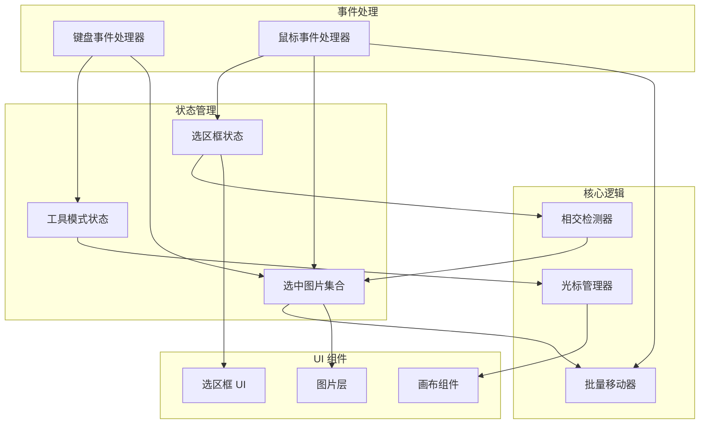

# 设计文档

## 概述

本设计文档描述画布多选功能的技术实现方案。该功能为画布应用引入工具模式切换机制和图片多选能力，使用户能够通过框选方式选中多张图片并批量移动它们。

核心功能包括：
1. 工具模式切换（移动工具 ↔ 抓手工具）
2. 空格键拖动画布
3. 框选多张图片
4. 批量移动选中图片
5. 键盘快捷键支持

## 架构



## 组件和接口

### 1. 工具模式管理

```typescript
// 工具模式类型
type ToolMode = 'move' | 'hand';

// 工具模式状态
interface ToolModeState {
  currentMode: ToolMode;           // 当前工具模式
  isSpacePressed: boolean;         // 空格键是否按下
  isDraggingCanvas: boolean;       // 是否正在拖动画布
}
```

### 2. 选中状态管理

```typescript
// 选中图片集合
interface SelectionState {
  selectedIds: Set<string>;        // 选中的图片 ID 集合
  isMultiSelecting: boolean;       // 是否正在框选
}

// 选中操作接口
interface SelectionActions {
  selectImage: (id: string, addToSelection?: boolean) => void;
  deselectImage: (id: string) => void;
  selectAll: () => void;
  clearSelection: () => void;
  toggleSelection: (id: string) => void;
  setSelectedIds: (ids: Set<string>) => void;
}
```

### 3. 选区框状态

```typescript
// 选区框状态
interface SelectionBoxState {
  isActive: boolean;               // 选区框是否激活
  startPoint: { x: number; y: number } | null;  // 起始点（画布坐标）
  endPoint: { x: number; y: number } | null;    // 结束点（画布坐标）
}

// 选区框矩形（标准化后）
interface SelectionRect {
  x: number;      // 左上角 x
  y: number;      // 左上角 y
  width: number;  // 宽度
  height: number; // 高度
}
```

### 4. 相交检测接口

```typescript
// 矩形相交检测
interface RectIntersection {
  // 检测两个矩形是否相交
  intersects: (rect1: SelectionRect, rect2: SelectionRect) => boolean;
  
  // 获取与选区框相交的所有图片 ID
  getIntersectingImages: (
    selectionRect: SelectionRect,
    images: CanvasImage[]
  ) => string[];
}
```

### 5. 批量移动接口

```typescript
// 批量移动状态
interface BatchMoveState {
  isDragging: boolean;             // 是否正在拖动
  dragStartPoint: { x: number; y: number } | null;  // 拖动起始点
  initialPositions: Map<string, { x: number; y: number }>;  // 初始位置
}

// 批量移动操作
interface BatchMoveActions {
  startBatchMove: (startPoint: { x: number; y: number }) => void;
  updateBatchMove: (currentPoint: { x: number; y: number }) => void;
  endBatchMove: () => void;
}
```

## 数据模型

### 扩展的画布状态

```typescript
interface ExtendedCanvasState {
  // 现有状态
  scale: number;
  position: { x: number; y: number };
  images: CanvasImage[];
  
  // 新增状态
  toolMode: ToolModeState;
  selection: SelectionState;
  selectionBox: SelectionBoxState;
  batchMove: BatchMoveState;
}
```

### 光标样式映射

```typescript
const cursorStyles: Record<string, string> = {
  'move-default': 'default',           // 移动工具默认
  'move-hover': 'move',                // 移动工具悬停图片
  'hand-default': 'grab',              // 抓手工具默认
  'hand-dragging': 'grabbing',         // 抓手工具拖动中
  'selecting': 'crosshair',            // 框选中
};
```

## 正确性属性

*属性是系统在所有有效执行中应该保持为真的特征或行为——本质上是关于系统应该做什么的形式化陈述。属性作为人类可读规范和机器可验证正确性保证之间的桥梁。*

### 属性 1：光标样式与工具模式一致性

*对于任意* 工具模式状态，光标样式应该与当前模式匹配：移动模式显示箭头，抓手模式显示 grab/grabbing

**验证: 需求 1.1, 1.2, 1.3, 1.4**

### 属性 2：空格键切换工具模式

*对于任意* 初始工具模式状态，按下空格键应该切换到抓手模式，释放空格键应该恢复到移动模式

**验证: 需求 2.1, 2.2, 2.3**

### 属性 3：抓手模式禁用选择功能

*对于任意* 处于抓手模式的状态，尝试进行图片选择或框选操作应该被阻止，选中状态不应改变

**验证: 需求 2.4**

### 属性 4：选区框矩形计算正确性

*对于任意* 起始点和结束点，计算出的选区框矩形应该正确处理所有四个象限方向（包括负坐标）

**验证: 需求 3.2, 8.3**

### 属性 5：矩形相交检测正确性

*对于任意* 选区框矩形和图片矩形，相交检测结果应该正确：当且仅当两个矩形有重叠区域时返回 true

**验证: 需求 3.3**

### 属性 6：框选结果与相交检测一致

*对于任意* 选区框和图片集合，框选完成后选中的图片集合应该等于与选区框相交的图片集合

**验证: 需求 3.3, 3.4, 3.5**

### 属性 7：选中状态视觉反馈一致性

*对于任意* 图片，其视觉高亮状态应该与其是否在选中集合中保持一致

**验证: 需求 4.1, 4.2, 4.3**

### 属性 8：点击选择逻辑正确性

*对于任意* 点击操作和 Shift 键状态，选中结果应该符合以下规则：
- 不按 Shift 点击未选中图片：仅选中该图片
- 按 Shift 点击未选中图片：添加到选中集合
- 按 Shift 点击已选中图片：从选中集合移除
- 不按 Shift 点击已选中图片：保持选中状态

**验证: 需求 5.1, 5.2, 5.3, 5.4**

### 属性 9：批量移动保持相对位置

*对于任意* 选中的图片集合和移动向量，移动后各图片之间的相对位置差应该与移动前相同

**验证: 需求 6.1, 6.2, 6.3**

### 属性 10：拖动未选中图片清除其他选择

*对于任意* 拖动未选中图片的操作，操作完成后应该仅有被拖动的图片处于选中状态

**验证: 需求 6.4**

### 属性 11：键盘快捷键功能正确性

*对于任意* 键盘快捷键操作：
- Delete/Backspace：删除所有选中图片
- Escape：清除选中状态
- Ctrl/Cmd+A：选中所有图片

**验证: 需求 7.1, 7.2, 7.3**

## 错误处理

### 边界情况处理

1. **空画布操作**
   - 在没有图片的画布上框选：不产生错误，选中集合为空
   - 全选空画布：不产生错误，选中集合为空

2. **快速操作**
   - 快速按下/释放空格键：正确切换模式，不产生状态不一致
   - 快速拖动：使用 requestAnimationFrame 节流，保证性能

3. **并发操作**
   - 同时按下多个修饰键：优先处理空格键（抓手模式）
   - 拖动过程中按下空格键：完成当前拖动操作，不切换模式

### 状态恢复

1. **异常中断**
   - 鼠标移出画布：结束当前拖动/框选操作
   - 窗口失焦：重置所有临时状态（拖动、框选）

2. **状态一致性**
   - 每次操作完成后验证状态一致性
   - 选中集合中的 ID 必须对应存在的图片

## 测试策略

### 单元测试

1. **相交检测函数测试**
   - 测试各种矩形位置关系（相交、包含、分离）
   - 测试边界情况（零尺寸矩形、负坐标）

2. **选区框计算测试**
   - 测试四个象限方向的选区框
   - 测试起点和终点相同的情况

3. **选择逻辑测试**
   - 测试各种点击和 Shift 组合
   - 测试边界情况（空选择、全选择）

### 属性测试

使用 fast-check 库进行属性测试，每个属性测试运行至少 100 次迭代。

1. **属性 4 测试：选区框矩形计算**
   - 生成随机起始点和结束点
   - 验证计算结果的 width 和 height 始终为正数
   - 验证 x, y 始终是矩形的左上角

2. **属性 5 测试：矩形相交检测**
   - 生成随机矩形对
   - 验证相交检测结果与数学定义一致

3. **属性 9 测试：批量移动保持相对位置**
   - 生成随机图片位置集合和移动向量
   - 验证移动前后相对位置差不变

### 集成测试

1. **完整框选流程**
   - 模拟从按下鼠标到释放的完整流程
   - 验证选中状态正确更新

2. **工具模式切换**
   - 模拟空格键按下/释放
   - 验证光标样式和功能状态正确切换

3. **批量移动流程**
   - 选中多张图片后拖动
   - 验证所有图片位置正确更新
