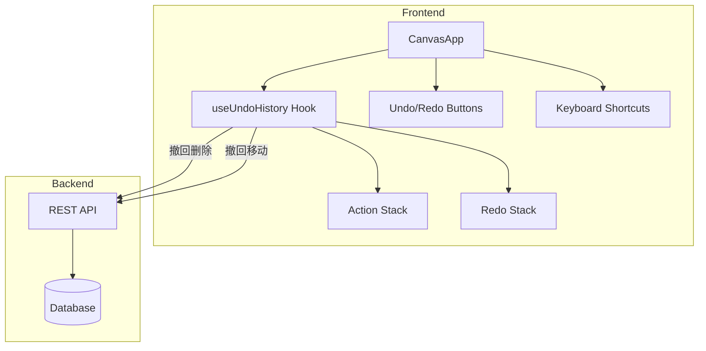
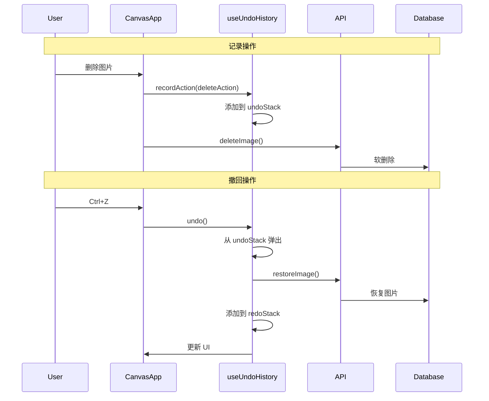

# 设计文档

## 概述

本设计文档描述画布撤回/重做功能的技术实现方案。该功能采用命令模式（Command Pattern）实现，通过维护操作历史栈来支持撤回和重做操作。系统将在前端维护操作历史，并在执行撤回/重做时同步更新后端数据。

## 架构

### 整体架构



### 数据流



## 组件和接口

### 操作类型定义

```typescript
// 操作类型枚举
type UndoActionType = 'delete' | 'move' | 'batch_move' | 'batch_delete';

// 删除操作数据
interface DeleteActionData {
  imageId: string;
  imageData: CanvasImage;  // 完整的图片数据，用于恢复
}

// 移动操作数据
interface MoveActionData {
  imageId: string;
  fromPosition: { x: number; y: number };
  toPosition: { x: number; y: number };
}

// 批量删除操作数据
interface BatchDeleteActionData {
  images: DeleteActionData[];
}

// 批量移动操作数据
interface BatchMoveActionData {
  moves: MoveActionData[];
}

// 操作记录
interface UndoAction {
  id: string;                    // 操作唯一标识
  type: UndoActionType;          // 操作类型
  timestamp: number;             // 操作时间戳
  data: DeleteActionData | MoveActionData | BatchDeleteActionData | BatchMoveActionData;
}
```

### useUndoHistory Hook 接口

```typescript
interface UseUndoHistoryReturn {
  // 状态
  canUndo: boolean;              // 是否可以撤回
  canRedo: boolean;              // 是否可以重做
  undoCount: number;             // 可撤回操作数量
  redoCount: number;             // 可重做操作数量
  isProcessing: boolean;         // 是否正在处理撤回/重做
  
  // 操作
  recordDeleteAction: (imageId: string, imageData: CanvasImage) => void;
  recordMoveAction: (imageId: string, from: Position, to: Position) => void;
  recordBatchDeleteAction: (images: Array<{ imageId: string; imageData: CanvasImage }>) => void;
  recordBatchMoveAction: (moves: Array<{ imageId: string; from: Position; to: Position }>) => void;
  undo: () => Promise<void>;
  redo: () => Promise<void>;
  clearHistory: () => void;
}
```

### 后端 API 接口

撤回删除操作需要调用现有的回收站恢复 API：

```typescript
// 恢复单张图片（已存在）
POST /api/trash/images/:id/restore

// 恢复多张图片（已存在）
POST /api/trash/images/restore
Body: { ids: string[] }
```

撤回移动操作使用现有的位置更新 API：

```typescript
// 更新图片位置（已存在）
PATCH /api/images/:id/canvas-position
Body: { canvasX: number, canvasY: number }
```

## 数据模型

### 操作历史栈

```typescript
// 操作历史管理
interface UndoHistoryState {
  undoStack: UndoAction[];       // 撤回栈（最新操作在栈顶）
  redoStack: UndoAction[];       // 重做栈（最近撤回的操作在栈顶）
  maxHistorySize: number;        // 最大历史记录数量（默认 50）
}
```

### 状态管理

操作历史仅在前端内存中维护，不持久化到后端。这样设计的原因：
1. 操作历史是会话级别的，页面刷新后清空是合理的
2. 避免增加后端复杂度
3. 减少网络请求

## 正确性属性

*正确性属性是指在所有有效执行中都应该保持为真的特性或行为。属性作为人类可读规范和机器可验证正确性保证之间的桥梁。*

### Property 1: 撤回栈大小限制

*对于任意* 操作序列，无论执行多少次记录操作，撤回栈的大小永远不应超过配置的最大值（50）

**验证: 需求 1.4**

### Property 2: 删除操作记录完整性

*对于任意* 删除操作，记录到撤回栈的操作数据应包含被删除图片的完整信息（id、url、位置等）

**验证: 需求 1.1**

### Property 3: 移动操作记录完整性

*对于任意* 移动操作，记录到撤回栈的操作数据应包含图片的原始位置和新位置

**验证: 需求 1.2**

### Property 4: 批量操作原子性

*对于任意* 批量移动或批量删除操作，应记录为单个操作，撤回时一次性恢复所有图片

**验证: 需求 1.3**

### Property 5: 撤回-重做栈转移

*对于任意* 非空撤回栈，执行撤回操作后，该操作应从撤回栈移动到重做栈

**验证: 需求 2.1, 2.3, 2.4**

### Property 6: 重做-撤回栈转移

*对于任意* 非空重做栈，执行重做操作后，该操作应从重做栈移动到撤回栈

**验证: 需求 3.1, 3.3, 3.4**

### Property 7: 新操作清空重做栈

*对于任意* 操作历史状态，当记录新操作时，重做栈应被清空

**验证: 需求 3.6**

### Property 8: 撤回-重做往返一致性

*对于任意* 操作，执行撤回后再执行重做，系统状态应与撤回前相同

**验证: 需求 2.3, 2.4, 3.3, 3.4**

### Property 9: 空栈状态一致性

*对于任意* 操作历史状态，canUndo 应等于 undoStack.length > 0，canRedo 应等于 redoStack.length > 0

**验证: 需求 2.5, 3.5**

### Property 10: 位置恢复准确性

*对于任意* 移动操作，撤回后图片的位置应精确等于移动前记录的原始位置

**验证: 需求 2.4, 6.1**

## 错误处理

### API 调用失败

当撤回/重做操作的 API 调用失败时：

1. 显示错误提示（Toast）
2. 保持当前状态不变
3. 不修改操作历史栈
4. 记录错误日志

```typescript
try {
  await executeUndo(action);
  // 成功后更新栈
  setUndoStack(prev => prev.slice(0, -1));
  setRedoStack(prev => [...prev, action]);
} catch (error) {
  // 失败时保持状态不变
  showToast('撤回操作失败，请重试', 'error');
  console.error('Undo failed:', error);
}
```

### 图片已被永久删除

当撤回恢复的图片已从回收站永久删除时：

1. API 返回 404 错误
2. 显示提示"该图片已被永久删除，无法恢复"
3. 从撤回栈中移除该操作
4. 不添加到重做栈

### 并发操作处理

使用 `isProcessing` 状态防止并发撤回/重做：

```typescript
const undo = async () => {
  if (isProcessing || !canUndo) return;
  setIsProcessing(true);
  try {
    // 执行撤回
  } finally {
    setIsProcessing(false);
  }
};
```

## 测试策略

### 单元测试

1. **操作记录测试**
   - 测试记录删除操作
   - 测试记录移动操作
   - 测试记录批量操作
   - 测试历史记录上限

2. **撤回操作测试**
   - 测试撤回删除操作
   - 测试撤回移动操作
   - 测试空栈时撤回

3. **重做操作测试**
   - 测试重做删除操作
   - 测试重做移动操作
   - 测试新操作后重做栈清空

### 属性测试

使用 fast-check 进行属性测试，验证上述正确性属性：

1. **栈大小限制属性测试**
   - 生成随机操作序列
   - 验证撤回栈永不超过最大值

2. **撤回-重做一致性测试**
   - 生成随机操作
   - 验证撤回后重做恢复原状态

3. **批量操作原子性测试**
   - 生成随机批量操作
   - 验证撤回时所有图片同时恢复

### 集成测试

1. 测试撤回删除后图片在画布上正确显示
2. 测试撤回移动后图片位置正确
3. 测试快捷键触发撤回/重做
4. 测试按钮状态与栈状态同步
