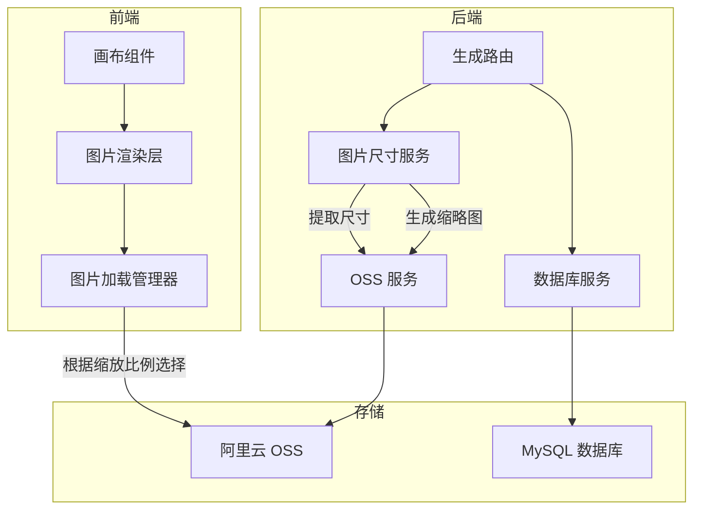

# 设计文档

## 概述

本设计实现图片按实际像素尺寸展示的功能，包括：
1. 后端在保存图片时提取实际尺寸并生成缩略图
2. 前端根据缩放比例动态加载原图或缩略图
3. 双击图片放大查看细节功能

## 架构



## 组件和接口

### 1. 图片尺寸服务（ImageDimensionService）

新增后端服务，负责从图片数据中提取尺寸并生成缩略图。

```typescript
interface ImageDimensions {
  width: number;   // 图片宽度（像素）
  height: number;  // 图片高度（像素）
}

interface ThumbnailResult {
  buffer: Buffer;      // 缩略图数据
  width: number;       // 缩略图宽度
  height: number;      // 缩略图高度
}

interface ImageDimensionService {
  // 从 Buffer 获取图片尺寸
  getDimensions(buffer: Buffer): Promise<ImageDimensions>;
  
  // 生成缩略图（较长边 400px）
  generateThumbnail(buffer: Buffer): Promise<ThumbnailResult>;
  
  // 从 URL 下载图片并获取尺寸和缩略图
  processImageFromUrl(url: string): Promise<{
    buffer: Buffer;
    dimensions: ImageDimensions;
    thumbnail: ThumbnailResult;
  }>;
}
```

### 2. OSS 服务扩展

扩展现有的 `aliOssService`，支持上传缩略图。

```typescript
interface AliOssService {
  // 现有方法...
  
  // 上传缩略图（新增）
  uploadThumbnail(buffer: Buffer, originalKey: string): Promise<{
    url: string;
    ossKey: string;
  }>;
}
```

### 3. 数据库 Schema 更新

`images` 表已有 `thumbnail_url` 字段，需要确保 `width` 和 `height` 字段存在。

```sql
-- 添加 width 和 height 字段（如果不存在）
ALTER TABLE `images` 
ADD COLUMN IF NOT EXISTS `width` INT UNSIGNED COMMENT '图片宽度（像素）',
ADD COLUMN IF NOT EXISTS `height` INT UNSIGNED COMMENT '图片高度（像素）';
```

### 4. 前端图片加载策略

修改 `CanvasImageLayer` 组件，根据缩放比例选择加载源，并实现缓存和防抖机制避免频繁切换。

```typescript
interface ImageLoadingStrategy {
  // 根据缩放比例和图片信息决定加载哪个 URL
  getImageUrl(image: CanvasImage, scale: number): string;
  
  // 判断是否应该加载原图
  shouldLoadOriginal(scale: number): boolean;
}

interface ImageCache {
  // 已加载的图片缓存（URL -> HTMLImageElement）
  cache: Map<string, HTMLImageElement>;
  
  // 预加载图片
  preload(url: string): Promise<HTMLImageElement>;
  
  // 获取缓存的图片
  get(url: string): HTMLImageElement | undefined;
  
  // 清理不在视口内的图片缓存
  cleanup(visibleImageIds: string[]): void;
}
```

**缓存和防抖策略：**
1. **浏览器缓存**：图片 URL 不变时，浏览器会自动使用缓存，不会重复请求
2. **内存缓存**：已加载的图片保存在 Map 中，切换时直接使用缓存
3. **防抖切换**：缩放停止 300ms 后才切换图片源，避免频繁切换
4. **预加载**：当接近阈值（scale 在 0.4-0.6 之间）时，预加载另一个版本
5. **渐进式切换**：先显示已有版本，新版本加载完成后再切换

### 5. 双击放大功能

在 `CanvasApp` 中添加双击处理逻辑。

```typescript
interface ZoomState {
  isZoomedIn: boolean;           // 是否处于放大状态
  previousPosition: { x: number; y: number };  // 之前的视口位置
  previousScale: number;         // 之前的缩放比例
  targetImageId: string | null;  // 放大的目标图片 ID
}
```

## 数据模型

### 图片记录（扩展）

```typescript
interface SavedImage {
  // 现有字段...
  width?: number;        // 图片宽度（像素）
  height?: number;       // 图片高度（像素）
  thumbnailUrl?: string; // 缩略图 URL
}
```

## 正确性属性

*属性是系统在所有有效执行中应保持为真的特征或行为——本质上是关于系统应该做什么的形式化陈述。属性作为人类可读规范和机器可验证正确性保证之间的桥梁。*

### Property 1: 尺寸提取准确性
*对于任意* 有效的图片 Buffer，调用 `getDimensions` 方法应返回与图片实际像素尺寸一致的宽度和高度值。
**Validates: Requirements 1.1**

### Property 2: 尺寸持久化一致性
*对于任意* 保存到数据库的图片记录，如果尺寸提取成功，则 `width` 和 `height` 字段应与原始图片的实际尺寸一致。
**Validates: Requirements 1.2**

### Property 3: 尺寸提取失败回退
*对于任意* 无效的图片数据（损坏或格式不支持），系统应返回预设尺寸而不是抛出异常。
**Validates: Requirements 1.4**

### Property 4: 缩放比例与图片源选择
*对于任意* 缩放比例值，当 scale < 0.5 时应选择缩略图 URL，当 scale >= 0.5 时应选择原图 URL。
**Validates: Requirements 3.1, 3.2, 3.3**

### Property 5: 视口外图片延迟加载
*对于任意* 不在当前视口范围内的图片，系统不应触发图片加载请求。
**Validates: Requirements 3.4**

### Property 6: 尺寸提取性能
*对于任意* 大小在 10MB 以内的图片，尺寸提取操作应在 500 毫秒内完成。
**Validates: Requirements 4.2**

### Property 7: 缩略图尺寸正确性
*对于任意* 原始图片，生成的缩略图较长边应为 400 像素，且宽高比与原图保持一致（误差 < 1%）。
**Validates: Requirements 5.2**

### Property 8: 缩略图持久化
*对于任意* 成功生成缩略图的图片，数据库记录的 `thumbnail_url` 字段应包含有效的 OSS URL。
**Validates: Requirements 5.3**

### Property 9: 双击放大恢复一致性
*对于任意* 视口状态，执行双击放大后再恢复，视口位置和缩放比例应与操作前一致。
**Validates: Requirements 6.3**

## 错误处理

| 错误场景 | 处理方式 |
|---------|---------|
| 图片下载失败 | 记录错误日志，使用原始 URL 保存，尺寸使用预设值 |
| 尺寸提取失败 | 记录警告日志，使用预设尺寸 |
| 缩略图生成失败 | 记录警告日志，thumbnail_url 保持为空 |
| OSS 上传缩略图失败 | 记录错误日志，继续保存原图 |
| 数据库更新失败 | 抛出异常，触发事务回滚 |

## 测试策略

### 单元测试

- 图片尺寸服务的 `getDimensions` 方法
- 缩略图生成的尺寸计算逻辑
- 前端图片 URL 选择逻辑
- 双击放大/恢复的状态管理

### 属性测试

使用 fast-check 库进行属性测试：

1. **尺寸提取准确性测试**：生成随机尺寸的测试图片，验证提取结果
2. **缩略图尺寸测试**：生成随机尺寸图片，验证缩略图较长边为 400px
3. **缩放比例选择测试**：生成随机缩放比例，验证图片源选择正确
4. **视口裁剪测试**：生成随机图片位置和视口，验证可见性判断正确

### 集成测试

- 完整的图片保存流程（生成 → 下载 → 提取尺寸 → 生成缩略图 → 上传 → 保存数据库）
- 前端加载图片并根据缩放切换图片源

