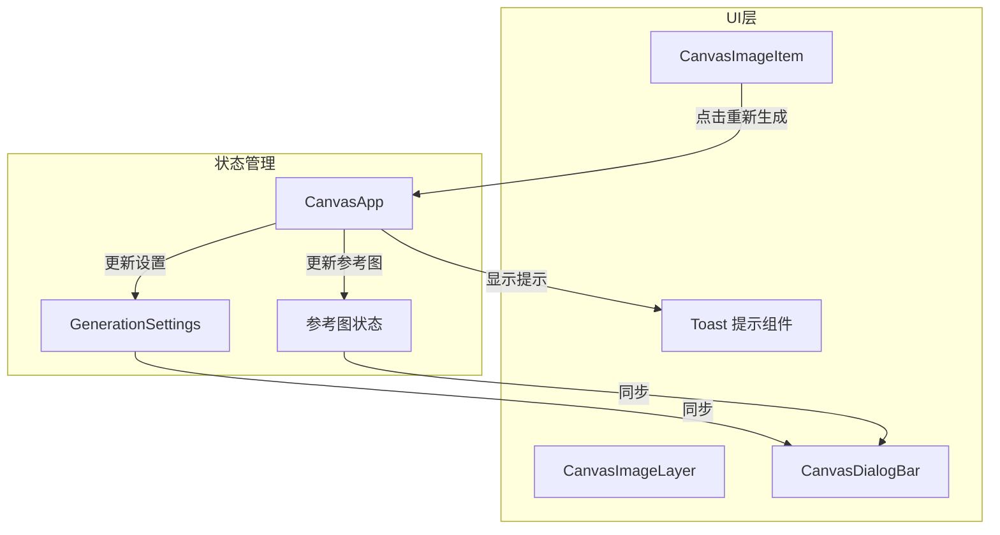

# 设计文档

## 概述

本功能为画布图片添加"重新生成"按钮，允许用户一键复用之前的生成参数。该功能通过在 `CanvasImageLayer` 组件中添加新的操作按钮，并在 `CanvasApp` 中实现参数回填逻辑来完成。

## 架构



## 组件和接口

### 1. CanvasImageItem 组件修改

在现有的操作按钮组中添加重新生成按钮：

```typescript
interface CanvasImageItemProps {
  // ... 现有属性
  onRegenerate?: () => void;  // 新增：重新生成回调
}
```

### 2. CanvasImageLayer 组件修改

传递重新生成回调到子组件：

```typescript
interface CanvasImageLayerProps {
  // ... 现有属性
  onRegenerateImage?: (image: CanvasImage) => void;  // 新增：重新生成回调
}
```

### 3. CanvasApp 参数回填函数

```typescript
/**
 * 处理重新生成 - 将图片参数填充到生成对话框
 * @param image 要复用参数的图片
 */
const handleRegenerateImage = async (image: CanvasImage) => void;
```

### 4. Toast 提示组件（可选）

用于显示操作反馈的轻量级提示组件：

```typescript
interface ToastProps {
  message: string;
  type: 'success' | 'error' | 'info';
  duration?: number;  // 显示时长，默认 2000ms
  onClose?: () => void;
}
```

## 数据模型

### 图片参数提取

从 `CanvasImage` 中提取用于重新生成的参数：

```typescript
interface RegenerateParams {
  prompt: string;           // 提示词
  model: string;            // 模型
  aspectRatio: string;      // 宽高比
  imageSize: string;        // 尺寸
  refImages?: {             // 参考图信息（简化格式）
    url: string;
    id: string;
  }[];
}
```

### 参考图恢复

参考图存储在数据库中的格式为简化格式（只有 url 和 id），需要转换为 `UploadedImage` 格式：

```typescript
// 数据库中的格式
interface StoredRefImage {
  url: string;
  id: string;
}

// 需要转换为
interface UploadedImage {
  id: string;
  file: File;        // 无法恢复，设为空
  base64?: string;   // 需要从 URL 加载
  preview: string;   // 使用 URL
  name: string;      // 从 URL 提取或使用默认值
  size: number;      // 无法获取，设为 0
}
```

## 正确性属性

*属性是系统在所有有效执行中应保持为真的特征或行为——本质上是关于系统应该做什么的形式化陈述。属性作为人类可读规范和机器可验证正确性保证之间的桥梁。*

### Property 1: 按钮可见性状态

*对于任意* 画布图片，当图片处于生成中状态（isPlaceholder 为 true 且 url 为空）时，重新生成按钮不应渲染；当图片处于正常状态或失败状态时，重新生成按钮应该渲染。

**Validates: Requirements 1.2, 1.3**

### Property 2: 参数填充完整性

*对于任意* 包含有效生成参数的画布图片，调用参数填充函数后，生成设置中的 prompt、model、aspectRatio、imageSize 应与图片中存储的对应值完全相等。

**Validates: Requirements 2.1, 2.2, 2.3, 2.4**

### Property 3: 生成中状态阻止填充

*对于任意* 生成中状态（isGenerating 为 true），调用参数填充函数应返回 false 或抛出错误，且生成设置不应被修改。

**Validates: Requirements 4.1**

### Property 4: 参数替换一致性

*对于任意* 现有生成设置和新的图片参数，调用参数填充函数后，生成设置应完全反映新图片的参数值，不保留旧的 prompt、model、aspectRatio、imageSize 值。

**Validates: Requirements 4.3**

## 错误处理

### 参考图加载失败

当参考图 URL 无法访问或加载失败时：
1. 记录错误日志
2. 显示提示信息："部分参考图无法恢复"
3. 继续填充其他参数，不阻塞整个操作

### 生成中状态

当用户在生成过程中点击重新生成按钮时：
1. 阻止参数填充
2. 显示提示信息："请等待当前生成完成"

## 测试策略

### 单元测试

1. 测试按钮在不同图片状态下的渲染逻辑
2. 测试参数提取函数的正确性
3. 测试参数填充函数的完整性

### 属性测试

使用 fast-check 库进行属性测试：

1. **Property 1 测试**：生成随机图片状态，验证按钮可见性逻辑
2. **Property 2 测试**：生成随机图片参数，验证填充后设置的一致性
3. **Property 3 测试**：在生成中状态下调用填充函数，验证阻止逻辑
4. **Property 4 测试**：生成随机现有设置和新参数，验证替换逻辑

### 测试标注格式

每个属性测试必须使用以下格式标注：
```typescript
// **Feature: image-regenerate, Property {number}: {property_text}**
```

### 测试配置

- 属性测试最少运行 100 次迭代
- 使用 fast-check 作为属性测试库
