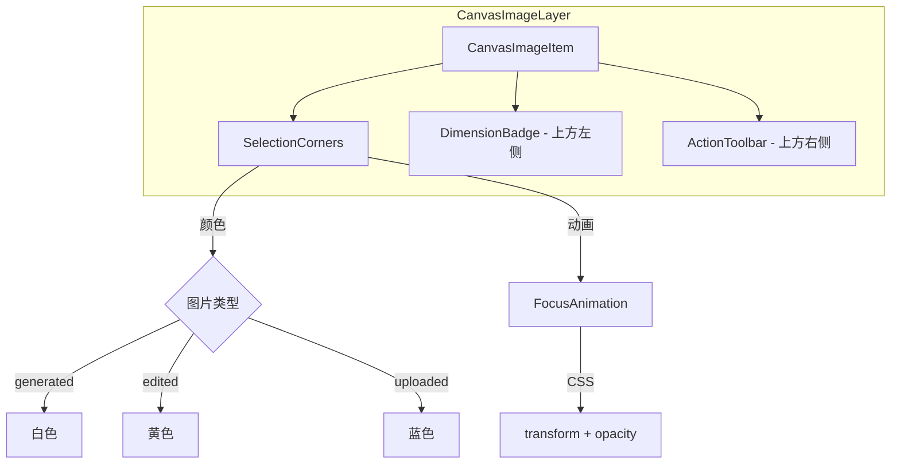

# 设计文档

## 概述

本设计重新定义画布图片的选中状态 UI，通过四角 L 形指示器和聚焦动画来提供更优雅的视觉反馈。核心改进包括：
- 使用颜色编码区分图片类型（生成/编辑/上传）
- 将像素信息和操作按钮移到图片外部
- 实现流畅的聚焦动画效果
- 拖拽时简化 UI 显示

## 架构



### 布局示意图

```
┌─────────────────────────────────────────────────────┐
│  [1024×768]                    [编辑][重生][分享][删除] │  ← 图片上方
├─────────────────────────────────────────────────────┤
│ ┌─                                               ─┐ │
│ │                                                 │ │
│                                                     │
│                      图片内容                        │
│                                                     │
│ │                                                 │ │
│ └─                                               ─┘ │
└─────────────────────────────────────────────────────┘
  ↑                                                 ↑
  四角指示器（L形）                              四角指示器（L形）
```

## 组件和接口

### SelectionCorners 组件

负责渲染四角 L 形选中指示器和聚焦动画。

```typescript
interface SelectionCornersProps {
  isSelected: boolean;           // 是否被选中
  imageType: 'generated' | 'edited' | 'uploaded';  // 图片类型
  width: number;                 // 图片宽度
  height: number;                // 图片高度
}

// 颜色映射
const CORNER_COLORS = {
  generated: '#FFFFFF',  // 纯白色
  edited: '#FACC15',     // 黄色 (Tailwind yellow-400)
  uploaded: '#3B82F6',   // 蓝色 (Tailwind blue-500)
} as const;

// 动画配置
const ANIMATION_CONFIG = {
  duration: 250,         // 动画时长 (ms)
  easing: 'ease-out',    // 缓动函数
  cornerSize: 20,        // 角落线条长度 (px)
  cornerThickness: 3,    // 角落线条粗细 (px)
  expandOffset: 8,       // 动画起始偏移量 (px)
};
```

### DimensionBadge 组件

显示图片像素尺寸，位于图片上方左侧。

```typescript
interface DimensionBadgeProps {
  width: number;                 // 图片实际宽度
  height: number;                // 图片实际高度
  isVisible: boolean;            // 是否显示
  isDragging: boolean;           // 是否正在拖拽
}

// 布局配置
const DIMENSION_BADGE_CONFIG = {
  offsetY: -32,                  // 距离图片顶部的偏移量 (px)
  offsetX: 0,                    // 距离图片左侧的偏移量 (px)
};
```

### ActionToolbar 组件

操作按钮工具栏，位于图片上方右侧，水平排列。

```typescript
interface ActionToolbarProps {
  image: CanvasImage;            // 图片数据
  isVisible: boolean;            // 是否显示
  isDragging: boolean;           // 是否正在拖拽
  onEdit?: () => void;           // 编辑回调
  onRegenerate?: () => void;     // 重新生成回调
  onAddAsReference?: () => void; // 添加为参考图回调
  onFavorite?: () => void;       // 收藏回调
  onDownload?: () => void;       // 下载回调
  onShare?: () => void;          // 分享回调
  onDelete?: () => void;         // 删除回调
}

// 布局配置
const ACTION_TOOLBAR_CONFIG = {
  offsetY: -32,                  // 距离图片顶部的偏移量 (px)
  gap: 4,                        // 按钮之间的间距 (px)
};
```

### 更新 CanvasImageItem 组件

```typescript
// 获取图片类型
const getImageType = (image: CanvasImage): 'generated' | 'edited' | 'uploaded' => {
  if (image.model === 'edited') return 'edited';
  if (image.model === 'uploaded') return 'uploaded';
  return 'generated';
};
```

## 数据模型

无需新增数据模型，复用现有的 `CanvasImage` 类型。图片类型通过 `model` 字段判断：
- `model === 'edited'` → 编辑过的图片
- `model === 'uploaded'` → 上传的图片
- 其他值 → 生成的图片

## 正确性属性

*正确性属性是指在系统所有有效执行中都应保持为真的特征或行为——本质上是关于系统应该做什么的形式化陈述。属性作为人类可读规范和机器可验证正确性保证之间的桥梁。*

### Property 1: 图片类型颜色映射一致性

*对于任意* 画布图片，其选中指示器的颜色应该与图片类型严格对应：
- 当 model 不是 'edited' 或 'uploaded' 时，返回 'generated' 类型，对应白色 (#FFFFFF)
- 当 model === 'edited' 时，返回 'edited' 类型，对应黄色 (#FACC15)
- 当 model === 'uploaded' 时，返回 'uploaded' 类型，对应蓝色 (#3B82F6)

**Validates: Requirements 1.1, 1.2, 1.3**

### Property 2: 选中状态与 UI 元素显示同步

*对于任意* 画布图片和选中状态组合：
- 当图片被选中且不在拖拽状态时，四角指示器、尺寸标签、操作工具栏都应该显示
- 当图片未被选中时，四角指示器、尺寸标签、操作工具栏都应该隐藏

**Validates: Requirements 1.5, 3.1, 3.4, 4.1, 4.4**

### Property 3: 拖拽状态 UI 简化

*对于任意* 正在被拖拽的选中图片：
- 尺寸标签应该隐藏
- 操作工具栏应该隐藏
- 四角指示器应该保持显示

**Validates: Requirements 3.5, 4.5, 5.1, 5.2**

### Property 4: 尺寸格式化一致性

*对于任意* 有效的宽度和高度值（正整数），格式化后的字符串应该符合 "宽度 × 高度" 的格式

**Validates: Requirements 3.2**

### Property 5: 重新生成按钮显示逻辑

*对于任意* 图片类型，重新生成按钮的显示应该遵循：
- 当图片类型为 'edited' 时，不显示重新生成按钮
- 当图片类型为 'uploaded' 时，不显示重新生成按钮
- 当图片类型为 'generated' 时，显示重新生成按钮

**Validates: Requirements 4.6**

### Property 6: 视口外图片不渲染选中 UI

*对于任意* 不在视口内的图片，即使被选中，也不应该渲染其选中 UI 元素（四角指示器、尺寸标签、操作工具栏）

**Validates: Requirements 6.5**

## 错误处理

1. **图片类型未知**：如果 `model` 字段为空或未知值，默认使用 `generated` 类型（白色指示器）
2. **尺寸数据缺失**：如果图片没有 width/height 数据，使用默认值 400×400
3. **动画性能问题**：如果检测到低性能设备，可以通过 `prefers-reduced-motion` 媒体查询禁用动画

## 测试策略

### 单元测试

1. **颜色映射测试**：验证 `getImageType` 函数对不同 model 值返回正确的类型
2. **组件渲染测试**：验证 SelectionCorners、DimensionBadge、ActionToolbar 在不同状态下的渲染

### 属性测试

使用 fast-check 进行属性测试，每个属性测试运行至少 100 次迭代。

1. **Property 1 测试**：生成随机图片数据，验证颜色映射一致性
2. **Property 2 测试**：生成随机选中状态，验证指示器显示逻辑
3. **Property 3 测试**：生成随机拖拽状态，验证 UI 元素显示/隐藏逻辑

### 视觉测试

1. 动画流畅度测试（手动验证）
2. 不同图片尺寸下的布局测试
3. 多选状态下的性能测试

## CSS 动画实现

```css
/* 聚焦动画关键帧 */
@keyframes focus-in {
  from {
    opacity: 0;
    transform: scale(1.2);
  }
  to {
    opacity: 1;
    transform: scale(1);
  }
}

@keyframes focus-out {
  from {
    opacity: 1;
    transform: scale(1);
  }
  to {
    opacity: 0;
    transform: scale(1.2);
  }
}

/* 选中角落样式 */
.selection-corner {
  position: absolute;
  width: 20px;
  height: 20px;
  pointer-events: none;
}

.selection-corner::before,
.selection-corner::after {
  content: '';
  position: absolute;
  background-color: currentColor;
}

/* 左上角 */
.corner-tl::before {
  top: 0;
  left: 0;
  width: 100%;
  height: 3px;
}
.corner-tl::after {
  top: 0;
  left: 0;
  width: 3px;
  height: 100%;
}

/* 动画状态 */
.selection-corners.entering {
  animation: focus-in 250ms ease-out forwards;
}

.selection-corners.exiting {
  animation: focus-out 250ms ease-out forwards;
}
```
