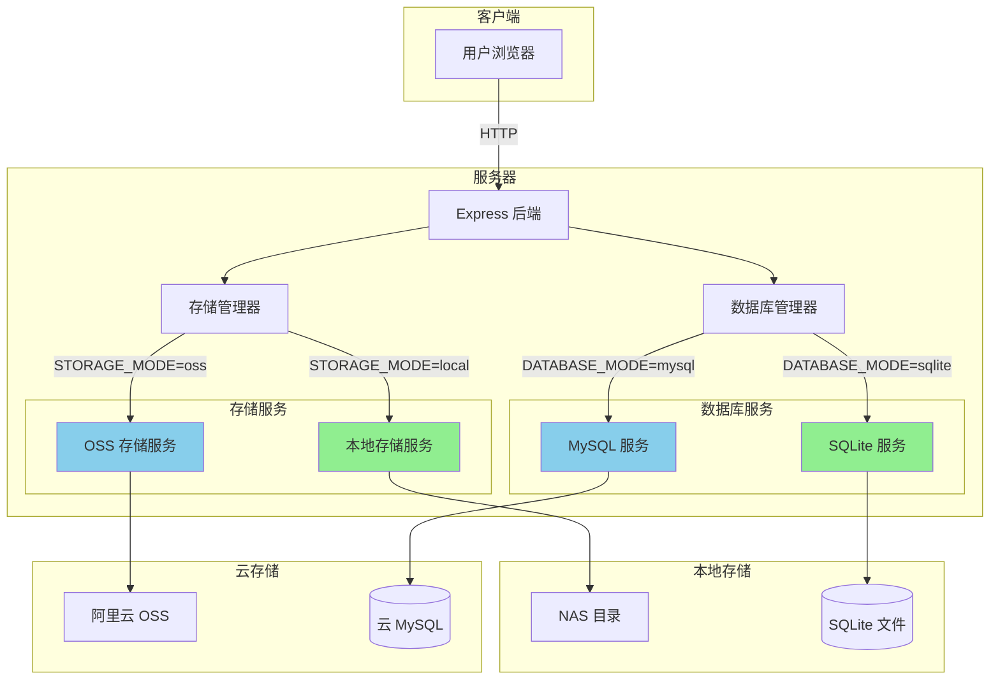

# 设计文档

## 概述

本设计文档描述了为系统增加本地 NAS 存储和 SQLite 数据库支持的技术方案。系统将支持**双模式运行**：

- **本地模式**：使用本地 NAS 存储 + SQLite 数据库，适合开发测试和局域网内部使用
- **云端模式**：使用阿里云 OSS + MySQL 数据库，适合正式上线部署

两种模式通过配置文件切换，代码层面完全兼容，可以随时在两种模式之间切换。

## 架构

### 双模式架构

系统支持两种运行模式，通过环境变量配置切换：

```
┌─────────────────────────────────────────────────────────────────┐
│                        用户浏览器                                │
└─────────────────────────────────────────────────────────────────┘
                              │
                              ▼
┌─────────────────────────────────────────────────────────────────┐
│                     Express 后端服务器                           │
│  ┌─────────────────────┐    ┌─────────────────────┐            │
│  │   存储管理器         │    │   数据库管理器       │            │
│  │  (StorageManager)   │    │ (DatabaseManager)   │            │
│  └─────────────────────┘    └─────────────────────┘            │
└─────────────────────────────────────────────────────────────────┘
         │                              │
         ▼                              ▼
┌────────────────────┐        ┌────────────────────┐
│  STORAGE_MODE=?    │        │  DATABASE_MODE=?   │
├────────────────────┤        ├────────────────────┤
│ local → 本地存储   │        │ sqlite → SQLite    │
│ oss   → 阿里云OSS  │        │ mysql  → 云MySQL   │
└────────────────────┘        └────────────────────┘
```

### 本地模式（开发/测试/局域网）

```
用户浏览器 → 本地后端服务器 → NAS 存储（局域网）
                          ↘ 本地 SQLite 数据库
```

### 云端模式（正式上线）

```
用户浏览器 → 云服务器 → 阿里云 OSS（公网）
                    ↘ 阿里云 MySQL 数据库
```

### 架构图



### 模式切换说明

| 场景 | 存储模式 | 数据库模式 | 说明 |
|-----|---------|-----------|------|
| 本地开发 | local | sqlite | 无需云服务，零成本 |
| 局域网使用 | local | sqlite | 20人内部使用，NAS 存储 |
| 正式上线 | oss | mysql | 云服务，安全稳定 |
| 混合模式 | oss | sqlite | 图片用云存储，数据库用本地（不推荐） |

## 组件和接口

### 1. 存储接口（StorageInterface）

统一的存储接口，本地存储和 OSS 存储都实现此接口：

```typescript
interface UploadResult {
  url: string;           // 访问 URL
  key: string;           // 存储键名（文件路径或 OSS Key）
  size: number;          // 文件大小
}

interface StorageInterface {
  // 初始化存储服务
  initialize(): boolean;
  
  // 检查是否已配置
  isConfigured(): boolean;
  
  // 从 URL 下载并上传图片
  uploadFromUrl(imageUrl: string, customKey?: string): Promise<UploadResult>;
  
  // 从 Buffer 上传图片
  uploadFromBuffer(buffer: Buffer, contentType: string, customKey?: string): Promise<UploadResult>;
  
  // 上传缩略图
  uploadThumbnail(buffer: Buffer, originalKey: string): Promise<{ url: string; key: string }>;
  
  // 删除文件
  deleteObject(key: string): Promise<boolean>;
  
  // 批量删除文件
  deleteObjects(keys: string[]): Promise<{ success: number; failed: number }>;
  
  // 测试连接
  testConnection(): Promise<boolean>;
  
  // 获取配置信息
  getConfigInfo(): object | null;
}
```

### 2. 本地存储服务（LocalStorageService）

实现 `StorageInterface`，将图片保存到本地 NAS 目录：

```typescript
class LocalStorageService implements StorageInterface {
  private basePath: string;        // NAS 挂载路径
  private serverUrl: string;       // 服务器访问地址
  
  // 生成文件路径：年/月/日/时间戳_随机字符串.jpg
  private generateFilePath(prefix: string): string;
  
  // 确保目录存在
  private ensureDirectoryExists(dirPath: string): Promise<void>;
  
  // 生成缩略图
  private generateThumbnail(buffer: Buffer): Promise<Buffer>;
}
```

### 3. 存储管理器（StorageManager）

根据配置选择使用哪种存储服务：

```typescript
class StorageManager {
  private localStorage: LocalStorageService | null;
  private ossStorage: AliOssService | null;
  private mode: 'local' | 'oss';
  
  // 获取当前存储服务
  getStorage(): StorageInterface;
  
  // 获取当前存储模式
  getMode(): 'local' | 'oss';
  
  // 切换存储模式
  setMode(mode: 'local' | 'oss'): void;
}
```

### 4. 静态文件路由（/api/images）

提供图片访问 API，包含目录穿越防护：

```typescript
// GET /api/images/:year/:month/:day/:filename
// 返回原图

// GET /api/images/thumb/:year/:month/:day/:filename
// 返回缩略图

// 安全检查：防止目录穿越攻击
function validatePath(basePath: string, requestedPath: string): string | null {
  const fullPath = path.resolve(basePath, requestedPath);
  // 确保解析后的路径仍在 basePath 下
  if (!fullPath.startsWith(path.resolve(basePath))) {
    return null; // 路径穿越攻击，拒绝访问
  }
  return fullPath;
}

// 响应头设置：
// Content-Type: image/jpeg | image/png | image/webp
// Cache-Control: public, max-age=31536000, immutable
```

### 安全措施

#### 目录穿越防护

静态文件服务必须防止目录穿越攻击（如 `../../../etc/passwd`）：

```typescript
// 示例实现
router.get('/images/*', (req, res) => {
  const requestedPath = req.params[0];
  const basePath = process.env.LOCAL_STORAGE_PATH;
  
  // 1. 解析完整路径
  const fullPath = path.resolve(basePath, requestedPath);
  
  // 2. 验证路径是否在允许范围内
  if (!fullPath.startsWith(path.resolve(basePath))) {
    return res.status(403).json({ error: '禁止访问' });
  }
  
  // 3. 检查文件是否存在
  if (!fs.existsSync(fullPath)) {
    return res.status(404).json({ error: '文件不存在' });
  }
  
  // 4. 返回文件
  res.sendFile(fullPath);
});
```

### 5. SQLite 数据库服务

扩展现有的 `DatabaseServiceImpl`，添加 SQLite 支持：

```typescript
class DatabaseServiceImpl {
  private connection: mysql.Connection | SQLiteDatabase | null;
  private mode: 'mysql' | 'sqlite';
  
  // 根据配置连接到对应数据库
  async connect(config: DatabaseConfig | SQLiteConfig): Promise<boolean>;
  
  // SQLite 特有方法
  private async connectSQLite(config: SQLiteConfig): Promise<boolean>;
  
  // 初始化 SQLite 表结构
  private async initializeSQLiteTables(): Promise<void>;
}
```

## 数据模型

### 目录结构

```
项目根目录/
├── data/
│   └── database.sqlite          # SQLite 数据库（本地 SSD）
└── ...

/Volumes/NAS/nano-banana/         # 或 Windows: D:\NAS\nano-banana\
├── images/
│   ├── 2024/
│   │   ├── 01/
│   │   │   ├── 02/
│   │   │   │   ├── 1704182400000_abc123.jpg      # 原图
│   │   │   │   └── 1704182400000_abc123_thumb.webp  # 缩略图
│   │   │   └── ...
│   │   └── ...
│   └── ...
└── backup/
    └── database.sqlite          # 数据库备份（定期同步）
```

### 配置项

```env
# 存储模式：oss | local
STORAGE_MODE=local

# 本地存储配置（图片存储到 NAS）
LOCAL_STORAGE_PATH=/Volumes/NAS/nano-banana/images
LOCAL_SERVER_URL=http://192.168.1.100:3000

# 数据库模式：mysql | sqlite
DATABASE_MODE=sqlite

# SQLite 配置（数据库放本地 SSD，不放 NAS）
# 原因：SQLite 对网络文件系统支持不好，放 NAS 会有性能和锁问题
SQLITE_PATH=./data/database.sqlite

# 数据库备份路径（可选，定期备份到 NAS）
SQLITE_BACKUP_PATH=/Volumes/NAS/nano-banana/backup/database.sqlite

# 服务器配置
HOST=0.0.0.0
PORT=3000
```

### 存储位置说明

| 数据类型 | 存储位置 | 原因 |
|---------|---------|------|
| SQLite 数据库 | 本地 SSD (`./data/`) | 性能好，文件锁可靠 |
| 图片文件 | NAS (`/Volumes/NAS/...`) | 容量大，方便共享 |
| 数据库备份 | NAS | 防止本地硬盘故障 |

### URL 格式对比

| 存储模式 | 原图 URL | 缩略图 URL |
|---------|---------|-----------|
| OSS | `https://bucket.region.aliyuncs.com/nano-banana/2024/01/02/xxx.jpg` | `https://bucket.region.aliyuncs.com/thumb/nano-banana/2024/01/02/xxx.webp` |
| 本地 | `http://192.168.1.100:3000/api/images/2024/01/02/xxx.jpg` | `http://192.168.1.100:3000/api/images/thumb/2024/01/02/xxx.webp` |


## 正确性属性

*正确性属性是指在系统所有有效执行中都应该保持为真的特征或行为——本质上是关于系统应该做什么的形式化陈述。属性作为人类可读规范和机器可验证正确性保证之间的桥梁。*


基于验收标准分析，以下是可测试的正确性属性：

### Property 1: 图片保存完整性

*对于任意*图片数据和保存操作，保存成功后应该同时存在原图文件和缩略图文件，且文件路径符合日期目录结构（年/月/日）。

**验证: 需求 1.1, 1.2, 1.3, 1.5**

### Property 2: 图片删除完整性

*对于任意*已保存的图片，执行删除操作后，原图和缩略图都应该不存在于存储中。

**验证: 需求 1.4**

### Property 3: 静态文件服务正确性

*对于任意*已保存的图片（jpg、png、webp 格式），通过 URL 请求应该返回正确的文件内容，且响应头包含适当的 Cache-Control 设置。

**验证: 需求 2.1, 2.2, 2.4**

### Property 4: 存储接口一致性

*对于任意*存储操作（上传、删除、获取），本地存储服务和 OSS 存储服务应该返回相同格式的结果，上层代码无需关心具体使用哪种存储。

**验证: 需求 3.4**

### Property 5: 数据库操作一致性

*对于任意*数据库操作（增删改查），SQLite 和 MySQL 应该产生相同的业务结果，数据格式和查询结果保持一致。

**验证: 需求 4.4**

### Property 6: 配置默认值

*对于任意*缺失的配置项，系统应该使用预定义的默认值，且默认值应该使系统能够正常启动。

**验证: 需求 5.2**

### Property 7: URL 生成正确性

*对于任意*保存的图片，返回的 URL 应该使用当前配置的服务器地址（本地模式使用 LOCAL_SERVER_URL，云端模式使用 OSS 域名）。

**验证: 需求 6.3**

## 错误处理

### 存储错误

| 错误类型 | 本地存储处理 | OSS 存储处理 |
|---------|-------------|-------------|
| 目录不存在 | 自动创建目录 | N/A |
| 磁盘空间不足 | 返回错误，记录日志 | 返回 OSS 错误 |
| 文件权限错误 | 返回错误，提示检查权限 | 返回 OSS 错误 |
| 网络错误 | N/A（本地操作） | 重试机制 |

### 数据库错误

| 错误类型 | SQLite 处理 | MySQL 处理 |
|---------|------------|------------|
| 文件不存在 | 自动创建数据库文件 | N/A |
| 连接失败 | 返回错误 | 重试机制 |
| 表不存在 | 自动创建表结构 | 自动创建表结构 |
| 并发冲突 | SQLite 内置锁机制 | 事务隔离 |

## 测试策略

### 单元测试

1. **LocalStorageService 测试**
   - 文件保存和读取
   - 目录自动创建
   - 缩略图生成
   - 文件删除

2. **StorageManager 测试**
   - 模式切换
   - 接口一致性

3. **SQLite 数据库测试**
   - 表结构创建
   - CRUD 操作
   - 与 MySQL 结果对比

### 属性测试

使用 fast-check 进行属性测试：

1. **存储往返测试**：保存图片后读取，内容应该一致
2. **删除完整性测试**：删除后文件不应存在
3. **接口一致性测试**：两种存储服务返回格式相同

### 集成测试

1. **端到端图片流程**：上传 → 保存 → 访问 → 删除
2. **模式切换测试**：切换存储模式后系统正常工作
3. **并发访问测试**：模拟 20 用户同时访问

## 数据迁移

### 从云端迁移到本地

如果需要将现有 OSS 图片迁移到本地 NAS：

1. 编写迁移脚本，从 OSS 下载所有图片到 NAS
2. 更新数据库中的图片 URL（将 OSS URL 替换为本地 URL）
3. 切换 STORAGE_MODE=local

### 从本地迁移到云端

如果需要将本地图片迁移到 OSS：

1. 编写迁移脚本，将 NAS 图片上传到 OSS
2. 更新数据库中的图片 URL（将本地 URL 替换为 OSS URL）
3. 切换 STORAGE_MODE=oss

### 数据库迁移

SQLite 和 MySQL 之间的数据迁移：

1. 导出当前数据库数据为 JSON
2. 切换数据库模式
3. 导入数据到新数据库

## 回滚方案

如果本地方案出现问题，可以快速回滚到云端模式：

```bash
# 修改 .env 文件
STORAGE_MODE=oss
DATABASE_MODE=mysql

# 重启服务
npm run dev
```

服务将立即切换回使用云存储和云数据库。
