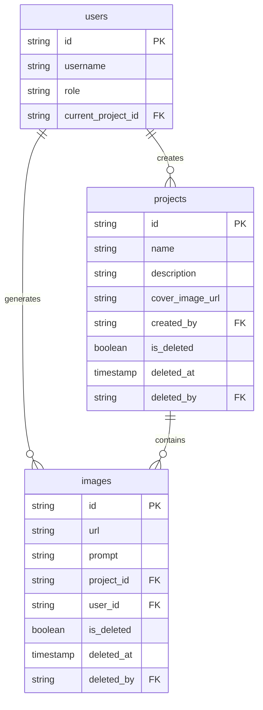

# 设计文档

## 概述

本设计文档描述了 Nano Banana AI 绘画应用的轻量级项目管理功能实现方案。该功能允许用户通过项目来组织生成的图片，同时提供回收站功能支持软删除和恢复操作。

## 架构

### 系统架构图

```mermaid
graph TB
    subgraph Frontend
        PC[ProjectContext] --> PS[ProjectSwitcher]
        PC --> IL[ImageLibrary]
        PC --> CA[CanvasApp]
        TB[TrashBin] --> PC
    end
    
    subgraph Backend
        PR[/api/projects] --> ProjS[ProjectService]
        TR[/api/trash] --> TrashS[TrashService]
        IR[/api/images] --> ImgS[ImageService]
        ProjS --> DB[(Database)]
        TrashS --> DB
        ImgS --> DB
    end
    
    Frontend --> Backend
```

### 数据流

1. 用户登录后，前端从后端获取项目列表和当前项目
2. 如果没有项目，后端自动创建默认项目
3. 生成图片时，前端将当前项目 ID 传递给后端
4. 删除操作执行软删除，记录移入回收站
5. 恢复操作将记录从回收站恢复

## 组件和接口

### 后端 API

#### 项目管理 API

| 方法 | 路径 | 描述 |
|------|------|------|
| GET | /api/projects | 获取所有项目列表（不包括已删除） |
| GET | /api/projects/:id | 获取单个项目详情 |
| POST | /api/projects | 创建新项目 |
| PUT | /api/projects/:id | 更新项目信息 |
| DELETE | /api/projects/:id | 软删除项目 |
| GET | /api/projects/current | 获取当前用户的当前项目 |
| PUT | /api/projects/:id/switch | 切换到指定项目 |

#### 回收站 API

| 方法 | 路径 | 描述 |
|------|------|------|
| GET | /api/trash | 获取回收站内容（项目和图片） |
| POST | /api/trash/restore/project/:id | 恢复已删除的项目 |
| POST | /api/trash/restore/image/:id | 恢复已删除的图片 |
| DELETE | /api/trash/project/:id | 永久删除项目（仅管理员） |
| DELETE | /api/trash/image/:id | 永久删除图片（仅管理员） |
| DELETE | /api/trash/empty | 清空回收站（仅管理员） |

### 前端组件

#### ProjectContext
- 管理当前项目状态
- 提供项目切换方法
- 在应用启动时初始化项目

#### ProjectSwitcher
- 显示当前项目名称
- 点击展开项目列表弹窗
- 大卡片 UI 展示项目
- 支持创建新项目

#### TrashBin
- 大卡片 UI 展示已删除内容
- 分类显示项目和图片
- 恢复按钮
- 管理员可见永久删除按钮

## 数据模型

### projects 表

```sql
CREATE TABLE IF NOT EXISTS `projects` (
  `id` VARCHAR(36) NOT NULL PRIMARY KEY COMMENT '项目唯一标识符（UUID）',
  `name` VARCHAR(100) NOT NULL COMMENT '项目名称',
  `description` TEXT COMMENT '项目描述',
  `cover_image_url` TEXT COMMENT '封面图片 URL',
  `created_by` VARCHAR(36) NOT NULL COMMENT '创建者用户 ID',
  `created_at` TIMESTAMP DEFAULT CURRENT_TIMESTAMP COMMENT '创建时间',
  `updated_at` TIMESTAMP DEFAULT CURRENT_TIMESTAMP ON UPDATE CURRENT_TIMESTAMP COMMENT '更新时间',
  `is_deleted` BOOLEAN DEFAULT FALSE COMMENT '是否已删除（软删除）',
  `deleted_at` TIMESTAMP NULL COMMENT '删除时间',
  `deleted_by` VARCHAR(36) NULL COMMENT '删除者用户 ID',
  
  INDEX `idx_created_by` (`created_by`),
  INDEX `idx_is_deleted` (`is_deleted`),
  INDEX `idx_created_at` (`created_at`)
) ENGINE=InnoDB DEFAULT CHARSET=utf8mb4 COLLATE=utf8mb4_unicode_ci COMMENT='项目表';
```

### images 表更新

在现有 images 表中添加以下字段：

```sql
ALTER TABLE `images` 
  ADD COLUMN `project_id` VARCHAR(36) NULL COMMENT '所属项目 ID',
  ADD COLUMN `is_deleted` BOOLEAN DEFAULT FALSE COMMENT '是否已删除（软删除）',
  ADD COLUMN `deleted_at` TIMESTAMP NULL COMMENT '删除时间',
  ADD COLUMN `deleted_by` VARCHAR(36) NULL COMMENT '删除者用户 ID',
  ADD INDEX `idx_project_id` (`project_id`),
  ADD INDEX `idx_is_deleted` (`is_deleted`);
```

### users 表更新

在现有 users 表中添加角色字段：

```sql
ALTER TABLE `users`
  ADD COLUMN `role` ENUM('user', 'admin') DEFAULT 'user' COMMENT '用户角色',
  ADD COLUMN `current_project_id` VARCHAR(36) NULL COMMENT '当前项目 ID';
```

### 数据模型关系



## 正确性属性

*属性是系统在所有有效执行中应保持为真的特征或行为——本质上是关于系统应该做什么的形式化陈述。属性作为人类可读规范和机器可验证正确性保证之间的桥梁。*

### 属性 1：默认项目自动创建
*对于任何* 没有项目的用户，当获取当前项目时，系统应该自动创建一个默认项目并返回
**验证: 需求 1.1, 1.3**

### 属性 2：项目列表不包含已删除项目
*对于任何* 项目列表查询，返回的结果应该只包含 is_deleted 为 false 的项目
**验证: 需求 2.3**

### 属性 3：项目创建者正确设置
*对于任何* 新创建的项目，其 created_by 字段应该等于创建者的用户 ID
**验证: 需求 3.1**

### 属性 4：项目名称必填验证
*对于任何* 创建项目请求，如果名称为空或仅包含空白字符，系统应该拒绝创建
**验证: 需求 3.2**

### 属性 5：图片关联项目
*对于任何* 保存的图片，其 project_id 字段应该被正确设置为当前项目 ID
**验证: 需求 4.1, 4.2**

### 属性 6：按项目筛选图片
*对于任何* 指定 project_id 的图片查询，返回的结果应该只包含该项目的未删除图片
**验证: 需求 4.3, 5.2, 5.3**

### 属性 7：项目更新持久化
*对于任何* 项目更新操作，更新后查询该项目应该返回新的值
**验证: 需求 6.2, 6.3**

### 属性 8：软删除记录删除信息
*对于任何* 软删除操作，被删除的记录应该设置 is_deleted 为 true，并记录 deleted_at 和 deleted_by
**验证: 需求 7.1, 7.2, 7.5**

### 属性 9：项目删除级联
*对于任何* 被软删除的项目，其下所有图片也应该被标记为已删除
**验证: 需求 7.3**

### 属性 10：回收站内容正确
*对于任何* 回收站查询，返回的结果应该只包含 is_deleted 为 true 的记录，并包含删除时间和删除者信息
**验证: 需求 8.2**

### 属性 11：恢复操作正确
*对于任何* 恢复操作，被恢复的记录应该设置 is_deleted 为 false，并清除 deleted_at 和 deleted_by
**验证: 需求 8.3**

### 属性 12：项目恢复级联
*对于任何* 被恢复的项目，其下所有被级联删除的图片也应该被恢复
**验证: 需求 8.4**

### 属性 13：图片恢复项目归属
*对于任何* 被恢复的图片，如果其原项目已删除，应该被归属到默认项目
**验证: 需求 8.5**

### 属性 14：硬删除级联
*对于任何* 被硬删除的项目，其下所有已删除的图片也应该被硬删除
**验证: 需求 9.4, 9.5**

### 属性 15：权限检查
*对于任何* 硬删除请求，只有管理员角色的用户才能执行，普通用户应该被拒绝
**验证: 需求 10.2, 10.3**

### 属性 16：默认用户角色
*对于任何* 新创建的用户，其角色应该默认为 'user'
**验证: 需求 10.1**

## 现有代码修改

### 图片删除逻辑修改

现有的图片删除逻辑会直接从数据库和 OSS 中删除图片。需要修改为软删除：

**修改前（硬删除）：**
1. 从 OSS 删除图片文件
2. 从数据库删除图片记录

**修改后（软删除）：**
1. 将图片记录的 `is_deleted` 设为 `true`
2. 记录 `deleted_at` 和 `deleted_by`
3. 不删除 OSS 文件（保留以便恢复）
4. 只有管理员执行硬删除时才真正删除 OSS 文件和数据库记录

### 需要修改的文件

1. `backend/src/services/databaseService.ts` - 修改 deleteImage 方法为软删除
2. `backend/src/routes/images.ts` - 修改删除接口逻辑
3. `frontend/src/components/ImageLibraryPage.tsx` - 修改删除按钮行为

## 错误处理

### 错误类型

| 错误码 | 描述 | HTTP 状态码 |
|--------|------|-------------|
| PROJECT_NOT_FOUND | 项目不存在 | 404 |
| PROJECT_DELETED | 项目已被删除 | 410 |
| PROJECT_NAME_REQUIRED | 项目名称不能为空 | 400 |
| PERMISSION_DENIED | 权限不足（非管理员执行硬删除） | 403 |
| IMAGE_NOT_FOUND | 图片不存在 | 404 |
| IMAGE_DELETED | 图片已被删除 | 410 |
| RESTORE_FAILED | 恢复操作失败 | 500 |

### 错误响应格式

```typescript
interface ErrorResponse {
  success: false;
  error: string;
  code: string;
  details?: any;
}
```

## 测试策略

### 单元测试

- ProjectService 的 CRUD 操作
- TrashService 的软删除、恢复、硬删除操作
- 权限检查逻辑
- 级联操作逻辑

### 属性测试

使用 fast-check 库进行属性测试：

- 每个属性测试运行至少 100 次迭代
- 测试标注格式：`**Feature: project-management, Property {number}: {property_text}**`
- 生成器约束到有效输入空间

### 测试框架

- 后端：Vitest + fast-check
- 前端：Vitest + React Testing Library

### 测试覆盖重点

1. 项目 CRUD 操作的正确性
2. 软删除和恢复的级联行为
3. 权限控制的正确性
4. 图片与项目的关联关系
5. 回收站内容的正确筛选
