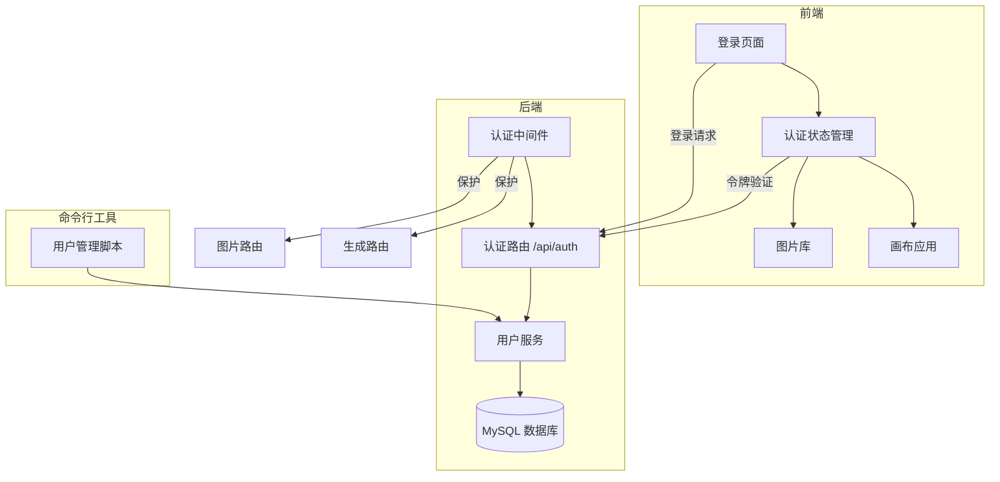

# 设计文档

## 概述

本设计实现一个简单的内部用户登录系统，采用 JWT（JSON Web Token）进行身份验证。系统包含后端认证服务、前端登录页面、以及命令行用户管理工具。设计遵循简单、稳定的原则，适合内部工具使用场景。

## 架构



## 组件和接口

### 1. 数据库层

#### users 表结构
```sql
CREATE TABLE users (
  id VARCHAR(36) PRIMARY KEY,           -- UUID 格式的用户唯一标识
  username VARCHAR(50) UNIQUE NOT NULL, -- 登录用户名
  password_hash VARCHAR(255) NOT NULL,  -- bcrypt 加密的密码
  display_name VARCHAR(100) NOT NULL,   -- 显示名称
  created_at TIMESTAMP DEFAULT CURRENT_TIMESTAMP,
  updated_at TIMESTAMP DEFAULT CURRENT_TIMESTAMP ON UPDATE CURRENT_TIMESTAMP,
  last_login_at TIMESTAMP NULL,         -- 最后登录时间
  is_active BOOLEAN DEFAULT TRUE        -- 账号是否启用
);
```

### 2. 后端服务

#### 用户服务 (userService.ts)
```typescript
interface UserService {
  // 创建用户（管理员使用）
  createUser(username: string, password: string, displayName: string): Promise<User>;
  
  // 验证用户凭据
  validateCredentials(username: string, password: string): Promise<User | null>;
  
  // 根据 ID 获取用户
  getUserById(id: string): Promise<User | null>;
  
  // 获取所有用户列表
  listUsers(): Promise<UserInfo[]>;
  
  // 更新最后登录时间
  updateLastLogin(userId: string): Promise<void>;
}
```

#### 认证服务 (authService.ts)
```typescript
interface AuthService {
  // 生成 JWT 令牌
  generateToken(user: User): string;
  
  // 验证 JWT 令牌
  verifyToken(token: string): TokenPayload | null;
  
  // 刷新令牌（可选）
  refreshToken(token: string): string | null;
}
```

#### API 路由 (routes/auth.ts)
```typescript
// POST /api/auth/login - 用户登录
// 请求: { username: string, password: string }
// 响应: { success: true, data: { token: string, user: UserInfo } }

// GET /api/auth/verify - 验证令牌
// 请求头: Authorization: Bearer <token>
// 响应: { success: true, data: { user: UserInfo } }

// POST /api/auth/logout - 退出登录（可选，主要用于日志记录）
// 请求头: Authorization: Bearer <token>
// 响应: { success: true }
```

#### 认证中间件 (middleware/auth.ts)
```typescript
// 验证请求中的 JWT 令牌
// 将用户信息附加到 req.user
// 未授权请求返回 401 状态码
```

### 3. 前端组件

#### 登录页面 (LoginPage.tsx)
- 用户名输入框
- 密码输入框
- 登录按钮
- 错误提示区域
- 玻璃态设计风格（与现有 UI 一致）

#### 认证上下文 (AuthContext.tsx)
```typescript
interface AuthContextType {
  user: UserInfo | null;        // 当前登录用户
  isAuthenticated: boolean;     // 是否已登录
  isLoading: boolean;           // 是否正在验证
  login: (username: string, password: string) => Promise<void>;
  logout: () => void;
}
```

#### 路由保护 (ProtectedRoute.tsx)
- 检查用户是否已登录
- 未登录时重定向到登录页面
- 已登录时渲染子组件

### 4. 命令行工具

#### 用户管理脚本 (scripts/manage-users.ts)
```bash
# 创建用户
npm run user:create -- --username=zhangsan --password=123456 --name="张三"

# 列出所有用户
npm run user:list

# 禁用用户
npm run user:disable -- --username=zhangsan
```

## 数据模型

### User（完整用户信息，仅后端使用）
```typescript
interface User {
  id: string;
  username: string;
  passwordHash: string;
  displayName: string;
  createdAt: Date;
  updatedAt: Date;
  lastLoginAt: Date | null;
  isActive: boolean;
}
```

### UserInfo（公开用户信息，前端使用）
```typescript
interface UserInfo {
  id: string;
  username: string;
  displayName: string;
  lastLoginAt: Date | null;
}
```

### TokenPayload（JWT 载荷）
```typescript
interface TokenPayload {
  userId: string;
  username: string;
  displayName: string;
  iat: number;  // 签发时间
  exp: number;  // 过期时间
}
```

## 正确性属性

*属性是系统在所有有效执行中应保持为真的特征或行为——本质上是关于系统应该做什么的形式化陈述。属性作为人类可读规范和机器可验证正确性保证之间的桥梁。*

### 属性 1：有效凭据登录成功
*对于任意*有效的用户名和密码组合，调用登录接口应返回成功响应，包含有效的 JWT 令牌和用户信息。
**验证: 需求 1.1, 4.4**

### 属性 2：无效凭据登录失败
*对于任意*无效的用户名或密码组合，调用登录接口应返回错误响应，不返回任何令牌。
**验证: 需求 1.2**

### 属性 3：未授权访问被拒绝
*对于任意*受保护的 API 端点，在没有有效令牌的情况下访问应返回 401 未授权状态码。
**验证: 需求 1.4, 5.3**

### 属性 4：有效令牌验证成功
*对于任意*有效且未过期的 JWT 令牌，调用验证接口应返回正确的用户信息。
**验证: 需求 2.2, 2.3**

### 属性 5：过期或无效令牌被拒绝
*对于任意*过期或格式无效的令牌，调用验证接口应返回错误响应。
**验证: 需求 2.4**

### 属性 6：用户创建和唯一 ID
*对于任意*新创建的用户，系统应生成唯一的用户 ID，且用户信息应正确存储到数据库。
**验证: 需求 3.1, 4.1**

### 属性 7：密码安全存储
*对于任意*用户密码，存储时应使用 bcrypt 加密，且原始密码可通过 bcrypt.compare 验证。
**验证: 需求 3.3**

### 属性 8：用户列表不包含密码
*对于任意*用户列表查询，返回的数据不应包含密码或密码哈希字段。
**验证: 需求 3.4**

### 属性 9：图片关联用户 ID
*对于任意*已登录用户生成的图片，图片记录应包含该用户的 ID。
**验证: 需求 4.2, 4.3**

## 错误处理

### 登录错误
| 错误场景 | HTTP 状态码 | 错误信息 |
|---------|------------|---------|
| 用户名或密码错误 | 401 | 用户名或密码错误 |
| 用户名或密码为空 | 400 | 请输入用户名和密码 |
| 账号已禁用 | 403 | 账号已被禁用，请联系管理员 |
| 服务器错误 | 500 | 登录失败，请稍后重试 |

### 令牌错误
| 错误场景 | HTTP 状态码 | 错误信息 |
|---------|------------|---------|
| 令牌缺失 | 401 | 请先登录 |
| 令牌无效 | 401 | 登录已失效，请重新登录 |
| 令牌过期 | 401 | 登录已过期，请重新登录 |

## 测试策略

### 单元测试
- 用户服务：创建用户、验证凭据、密码加密
- 认证服务：令牌生成、令牌验证、令牌过期处理

### 属性测试
使用 fast-check 库进行属性测试：
- 测试有效/无效凭据的登录行为
- 测试令牌验证的正确性
- 测试密码加密的安全性

### 集成测试
- 完整登录流程测试
- 受保护路由访问测试
- 用户管理命令行工具测试

## 安全考虑

1. **密码存储**：使用 bcrypt（cost factor = 10）加密存储
2. **JWT 配置**：
   - 签名算法：HS256
   - 过期时间：7 天（内部工具，可适当延长）
   - 密钥：从环境变量 `JWT_SECRET` 读取
3. **传输安全**：生产环境使用 HTTPS
4. **错误信息**：不泄露具体是用户名还是密码错误
