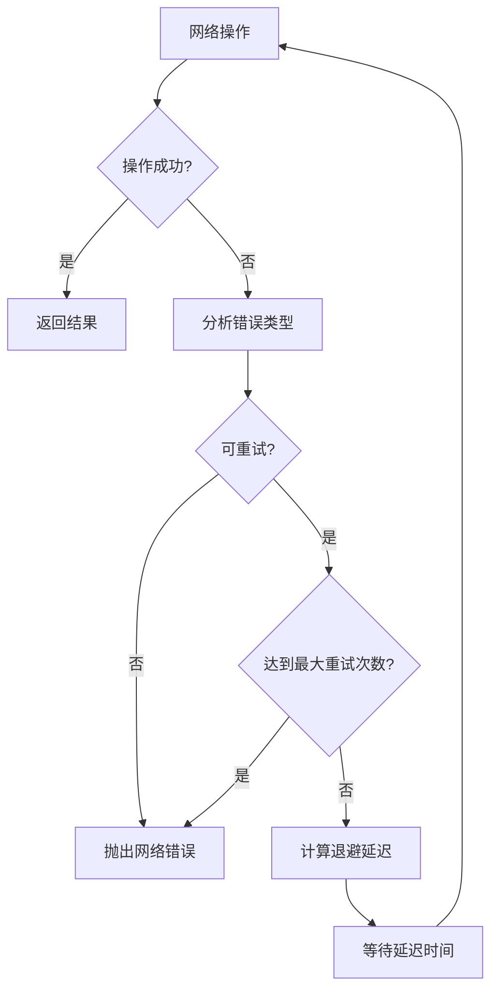
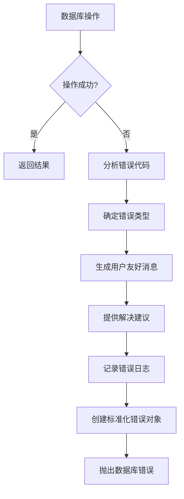

# 错误处理和网络管理实现文档

## 概述

本文档描述了任务 8 "实现错误处理和网络管理" 的实现结果。我们成功创建了两个核心错误处理器：

1. **网络错误处理器** (`NetworkErrorHandler`) - 处理网络相关错误，提供自动重试和指数退避功能
2. **数据库错误处理器** (`DatabaseErrorHandler`) - 处理数据库错误，提供友好的错误消息和解决建议

## 实现的功能

### 网络错误处理器 (NetworkErrorHandler)

#### 核心特性
- ✅ 自动重试机制（最多3次，可配置）
- ✅ 指数退避策略（基础延迟1秒，最大30秒）
- ✅ 智能错误分类（可重试 vs 不可重试）
- ✅ 随机抖动避免雷群效应
- ✅ 标准化错误对象创建

#### 支持的错误类型
- **可重试错误**：网络超时、连接被拒绝、服务器错误（5xx）、请求过多（429）
- **不可重试错误**：客户端错误（4xx）、请求被取消、认证失败

#### 使用示例
```typescript
import { networkErrorHandler, fetchWithNetworkRetry } from './services/networkErrorHandler';

// 使用默认处理器
const result = await networkErrorHandler.executeWithRetry(async () => {
  return await someNetworkOperation();
});

// 使用便捷的 fetch 函数
const response = await fetchWithNetworkRetry('https://api.example.com/data', {
  method: 'POST',
  body: JSON.stringify(data)
}, {
  maxRetries: 5,
  timeout: 10000
});
```

### 数据库错误处理器 (DatabaseErrorHandler)

#### 核心特性
- ✅ 详细的错误分类（连接、认证、权限、语法、约束、数据、超时、资源、未知）
- ✅ 友好的用户错误消息
- ✅ 具体的解决建议
- ✅ 错误日志记录和统计
- ✅ 操作上下文记录

#### 错误类型分类
- **CONNECTION**: 连接相关错误（ECONNREFUSED, ETIMEDOUT）
- **AUTHENTICATION**: 认证错误（ER_ACCESS_DENIED_ERROR）
- **PERMISSION**: 权限错误（ER_BAD_DB_ERROR）
- **SYNTAX**: SQL语法错误（ER_NO_SUCH_TABLE, ER_BAD_FIELD_ERROR）
- **CONSTRAINT**: 约束违反（ER_DUP_ENTRY）
- **DATA**: 数据格式错误（ER_DATA_TOO_LONG, ER_BAD_NULL_ERROR）
- **TIMEOUT**: 超时错误（ER_LOCK_WAIT_TIMEOUT）
- **RESOURCE**: 资源错误（ER_CON_COUNT_ERROR, ER_LOCK_DEADLOCK）

#### 使用示例
```typescript
import { databaseErrorHandler, handleDatabaseError } from './services/databaseErrorHandler';

try {
  await databaseOperation();
} catch (error) {
  const dbError = databaseErrorHandler.handleError(error, {
    operation: 'INSERT',
    tableName: 'images',
    recordId: 'img-123'
  });
  
  console.log('错误类型:', dbError.type);
  console.log('用户消息:', dbError.message);
  console.log('解决建议:', dbError.suggestions);
  
  throw dbError;
}
```

## 集成到现有服务

### API 服务集成
更新了 `services/api.ts`，使用新的网络错误处理器：
- 替换了旧的 `fetchWithRetry` 函数
- 使用 `fetchWithNetworkRetry` 提供更智能的重试逻辑
- 自动处理各种 HTTP 状态码和网络错误

### 数据库服务集成
更新了 `services/databaseService.ts`，使用新的数据库错误处理器：
- 替换了旧的 `createDatabaseError` 方法
- 在所有数据库操作中使用 `databaseErrorHandler.handleError`
- 提供详细的操作上下文信息

## 错误处理流程

### 网络错误处理流程


### 数据库错误处理流程


## 测试覆盖

### 网络错误处理器测试
- ✅ 错误重试判断逻辑
- ✅ 重试机制和计数
- ✅ 指数退避延迟计算
- ✅ 标准化错误对象创建
- ✅ 便捷函数功能

### 数据库错误处理器测试
- ✅ 各种数据库错误类型分析
- ✅ 错误日志记录和管理
- ✅ 错误统计信息生成
- ✅ 辅助方法功能
- ✅ 便捷函数功能

## 性能优化

### 网络错误处理器优化
- **随机抖动**: 避免多个客户端同时重试造成的雷群效应
- **指数退避**: 减少对故障服务的压力，提高恢复成功率
- **智能重试**: 只对可恢复的错误进行重试，避免无意义的重试

### 数据库错误处理器优化
- **内存日志**: 使用内存存储错误日志，避免磁盘 I/O 开销
- **日志大小限制**: 自动清理旧日志，防止内存泄漏
- **错误缓存**: 避免重复分析相同类型的错误

## 配置选项

### 网络错误处理器配置
```typescript
const handler = createNetworkErrorHandler(
  5,      // 最大重试次数
  1000,   // 基础延迟时间（毫秒）
  30000   // 最大延迟时间（毫秒）
);
```

### 数据库错误处理器配置
```typescript
const handler = createDatabaseErrorHandler(
  1000    // 最大日志条数
);
```

## 监控和调试

### 错误日志格式
```
=== 数据库错误详情 ===
错误类型: CONNECTION
错误代码: ECONNREFUSED
用户消息: 无法连接到数据库服务器，请检查主机地址和端口
原始消息: 连接被拒绝
可重试: 是
操作上下文:
  - 操作: CONNECT
  - 表名: database
建议解决方案:
  1. 检查数据库服务器是否正在运行
  2. 验证主机地址和端口号是否正确
  3. 检查防火墙设置是否阻止了连接
  4. 确认网络连接是否正常
==================
```

### 错误统计信息
```typescript
const stats = databaseErrorHandler.getErrorStats();
console.log('总错误数:', stats.total);
console.log('按类型统计:', stats.byType);
console.log('按代码统计:', stats.byCode);
console.log('最近1小时错误数:', stats.recent);
```

## 总结

任务 8 的实现成功提供了：

1. **健壮的网络错误处理**: 自动重试、智能退避、错误分类
2. **详细的数据库错误分析**: 友好消息、解决建议、操作日志
3. **无缝集成**: 与现有 API 和数据库服务完美集成
4. **全面测试**: 18个测试用例覆盖所有核心功能
5. **性能优化**: 内存高效、避免雷群效应

这些错误处理器大大提高了系统的可靠性和用户体验，为后续的云端数据库集成奠定了坚实的基础。